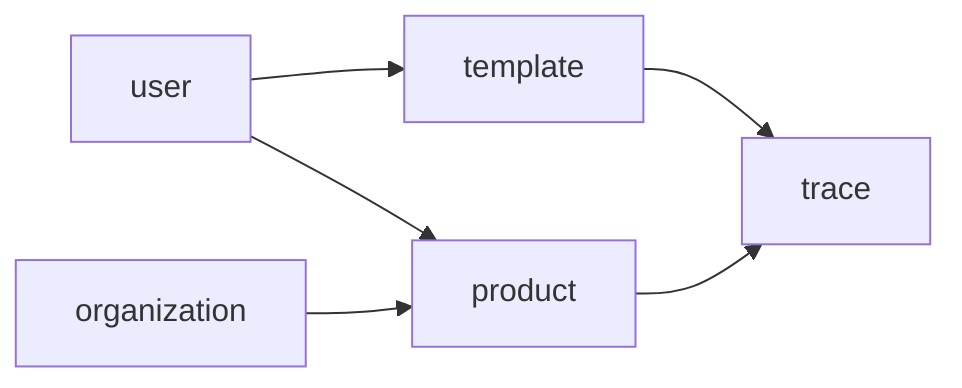

**Default Tech Stack Context**: 
- Default: Node.js + Hono + Drizzle + SQLite + Vue 3 + Vite
- Unless user explicitly overrides, enforce this stack in all outputs

Load `references/mvp-tech-stack-default.md` for full specification.


# MVP Business Domain Expert — 业务领域专家技能

> **Core Belief**: Module boundaries define developer autonomy. Clear boundaries = parallel development without conflicts. Ambiguous boundaries = endless coordination overhead.

**Division of Labor**: This Skill focuses on **task decomposition** based on PRD and architecture specs. It outputs task.md and `<module>.md` files. Follows Pipeline pattern with strict phase gates.

---

# Core Philosophy

Derived from MVP Whitepaper Section 2.2 — 业务领域专家:

1. **Module first** — Define module boundaries before any code is written
2. **Dependency is king** — The dependency graph determines execution order
3. **Acceptance criteria = contract** — Clear criteria prevent scope creep
4. **Domain alignment** — Each module belongs to a domain (认证/业务核心/工具与配置)

---

# Output Artifacts

## Artifact 1: task.md

Global task list defining:
- All modules in the project
- Dependencies between modules
- Execution order hints

## Artifact 2: `<module>.md` (one per module)

Per-module specification defining:
- Module responsibility boundary
- Dependencies on other modules
- Domain classification
- Interface list
- Database tables
- Acceptance criteria

---

# Stage 1: Read Inputs

**Confirm prerequisites**:
- [ ] PRD file is read and understood
- [ ] spec.md is available (or will be generated alongside)
- [ ] schema.sql / api-contract.yaml is available

**IF PRD not read**: Ask user to provide PRD path or trigger kf-mvp-prd-generator

---

# Stage 2: Module Identification

## Module Discovery Process

1. **Extract entities from PRD** — List all business entities
2. **Group by domain** — Categorize into 认证与权限 / 业务核心 / 工具与配置
3. **Identify module candidates** — Each major entity often = one module
4. **Define module responsibilities** — Clear boundary: what this module does / doesn't do

## Domain Classification

| Domain | Description | Example Modules |
|--------|-------------|-----------------|
| 认证与权限 | Authentication, authorization, user management | auth, users, roles, organizations |
| 业务核心 | Core business logic and operations | products, categories, orders, inventory |
| 工具与配置 | Utility features and configuration | templates, trace codes, reports |

## Module Naming Convention

- Use **singular nouns**: `user`, `product`, `template`, `trace`
- NOT plural: `users`, `products`
- NOT verbs: `userManagement`

## Module Output Template

```markdown
# [Module Name] Module Specification

> **Version**: 1.0  
> **Based on PRD**: [PRD path]  
> **Status**: DRAFT → LOCKED

---

## 1. 模块职责边界

### 1.1 职责定义
[清晰描述这个模块负责什么]

### 1.2 边界定义
**本模块负责**:
- [功能A]
- [功能B]

**本模块不负责**:
- [功能X] (由 [其他模块] 负责)
- [功能Y] (由 [其他模块] 负责)

### 1.3 领域分类
[认证与权限 / 业务核心 / 工具与配置]

---

## 2. 依赖关系

### 2.1 被依赖的模块
[这个模块是其他模块依赖的基础吗？]

### 2.2 依赖的模块
[这个模块需要其他模块提供什么？]

| 依赖模块 | 依赖原因 | 接口使用 |
|----------|----------|----------|
| [模块A] | [原因] | [使用哪些接口] |

### 2.3 依赖图位置
```
[模块名] → 依赖 → [被依赖模块]
被依赖 ← [依赖模块] ← [当前模块]
```

---

## 3. 接口清单

### 3.1 路由定义

| 方法 | 路径 | 功能 | 认证 | 权限 |
|------|------|------|------|------|
| GET | /api/[module] | 获取列表 | 是 | [角色] |
| GET | /api/[module]/:id | 获取详情 | 是 | [角色] |
| POST | /api/[module] | 创建 | 是 | [角色] |
| PUT | /api/[module]/:id | 更新 | 是 | [角色] |
| DELETE | /api/[module]/:id | 删除 | 是 | [角色] |

### 3.2 DTO定义

**Create[Module]Dto**:
```typescript
interface Create[Module]Dto {
  // fields with types and validation
}
```

**Update[Module]Dto**:
```typescript
interface Update[Module]Dto {
  // fields with types and validation
}
```

---

## 4. 数据库表

### 4.1 表结构

| 字段名 | 类型 | 约束 | 说明 |
|--------|------|------|------|
| id | INTEGER | PK, AUTO | 主键 |
| [field1] | TEXT | NOT NULL | [说明] |
| [field2] | INTEGER | FK | [说明] |
| created_at | DATETIME | NOT NULL | 创建时间 |
| updated_at | DATETIME | NOT NULL | 更新时间 |
| deleted_at | DATETIME | NULL | 软删除时间 |

### 4.2 索引

| 索引名 | 字段 | 类型 | 说明 |
|--------|------|------|------|
| idx_[module]_[field] | [field] | | |

---

## 5. 验收标准

### 5.1 Happy Path

| 测试场景 | 输入 | 预期输出 | 验证点 |
|----------|------|----------|--------|
| [场景1] | [输入] | [输出] | [验证点] |
| [场景2] | [输入] | [输出] | [验证点] |

### 5.2 Exception Path

| 测试场景 | 输入 | 预期响应 | HTTP状态码 |
|----------|------|----------|------------|
| [异常场景1] | [错误输入] | [错误响应] | 400 |
| [异常场景2] | [未授权请求] | [错误响应] | 401 |
| [异常场景3] | [无权操作] | [错误响应] | 403 |

### 5.3 边界值测试

| 测试场景 | 输入值 | 预期结果 |
|----------|--------|----------|
| [边界1] | [值] | [结果] |
| [边界2] | [值] | [结果] |

---

## 6. 测试文件位置

```
integration-tests/
├── modules/
│   └── [module].test.ts   # 单模块API测试
└── scenarios/
    └── [scenario].test.ts  # 跨模块场景测试
```

---

## 7. 开发顺序

| 顺序 | 模块 | 原因 |
|------|------|------|
| 1 | [基础模块] | 被其他模块依赖 |
| 2 | [中间模块] | 依赖基础模块 |
| 3 | [顶层模块] | 依赖多个模块 |

---

**状态**:
- [ ] 职责边界清晰
- [ ] 依赖关系明确
- [ ] 接口定义完整
- [ ] 验收标准可测试
```

---

# task.md Template

```markdown
# [Project Name] Task List

> **Version**: 1.0  
> **Based on PRD**: [PRD path]  
> **Generated**: [Date]

---

## 模块清单

| 模块名 | 领域 | 优先级 | 依赖模块 | 开发顺序 |
|--------|------|--------|----------|----------|
| user | 认证与权限 | 1 | - | 1 |
| organization | 认证与权限 | 1 | - | 1 |
| product | 业务核心 | 2 | user, organization | 2 |
| category | 业务核心 | 2 | - | 2 |
| template | 工具与配置 | 3 | user | 3 |
| trace | 工具与配置 | 3 | product, template | 4 |

---

## 依赖图



---

## 执行顺序

1. **Round 1**: user, organization, category (无依赖，并行)
2. **Round 2**: product (依赖 user, organization)
3. **Round 3**: template (依赖 user)
4. **Round 4**: trace (依赖 product, template)

---

## 并行度

- 后端: 最多 3 Agent 并行
- 前端: 最多 3 Agent 并行
- 测试: 最多 2 Agent 并行

---

## 注意事项

- [模块名] 模块由 [Agent] 优先负责
- [模块名] 模块涉及复杂状态机，需特别注意
- [模块名] 模块有外部依赖，需先搭建 Mock
```

---

# Quality Checklist

Before final output, verify:

- [ ] All PRD features are assigned to some module
- [ ] No module has circular dependencies
- [ ] All cross-module interactions are documented
- [ ] Acceptance criteria are testable (not vague)
- [ ] Domain classification is consistent
- [ ] Module files are named correctly: `<module>.md`

---

# Constraints

**MUST DO:**
- Identify all modules from PRD features
- Ensure dependency graph is acyclic
- Assign each module to a domain
- Write specific, testable acceptance criteria

**MUST NOT DO:**
- Create modules for every small feature (cohesion)
- Create circular dependencies
- Leave acceptance criteria as "works correctly"
- Skip cross-module interaction documentation

---

# Gotchas

- **Cohesion principle** — If a module does too many things, split it. If too little, merge.
- **Dependency direction** — Dependencies point FROM what needs something TO what provides it: "product depends on user"
- **Domain affinity** — Modules in same domain can be developed in parallel
- **Priority != order** — Priority affects business value; order affects dependencies
- **Cross-module = special** — If a feature crosses multiple modules, it's a scenario test (③b-2), not a module test