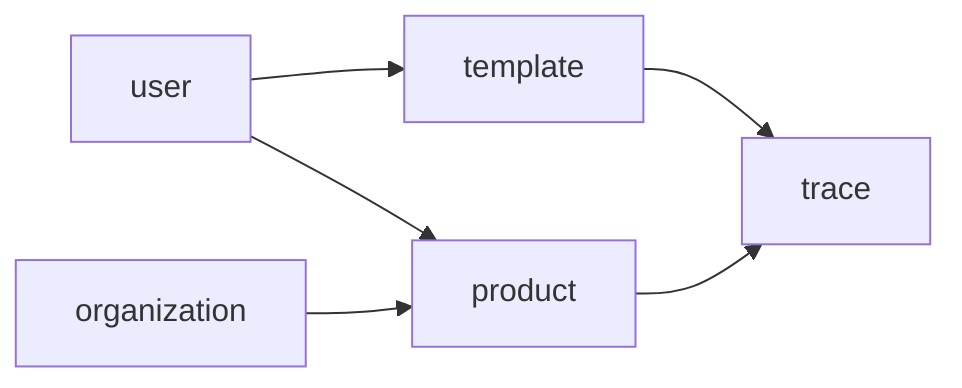

**Default Tech Stack Context**: 
- Default: Node.js + Hono + Drizzle + SQLite + Vue 3 + Vite
- Unless user explicitly overrides, enforce this stack in all outputs

Load `references/mvp-tech-stack-default.md` for full specification.


# MVP Business Domain Expert — 业务领域专家技能

> **Core Belief**: Module boundaries define developer autonomy. Clear boundaries = parallel development without conflicts. Ambiguous boundaries = endless coordination overhead.

**Division of Labor**: This Skill focuses on **task decomposition** based on PRD and architecture specs. It outputs task.md and `<module>.md` files. Follows Pipeline pattern with strict phase gates.

---

# Core Philosophy

Derived from MVP Whitepaper Section 2.2 — 业务领域专家:

1. **Module first** — Define module boundaries before any code is written
2. **Dependency is king** — The dependency graph determines execution order
3. **Acceptance criteria = contract** — Clear criteria prevent scope creep
4. **Domain alignment** — Each module belongs to a domain (认证/业务核心/工具与配置)

---

# Output Artifacts

## Artifact 1: task.md

Global task list defining:
- All modules in the project
- Dependencies between modules
- Execution order hints

## Artifact 2: `<module>.md` (one per module)

Per-module specification defining:
- Module responsibility boundary
- Dependencies on other modules
- Domain classification
- Interface list
- Database tables
- Acceptance criteria

---

# Stage 1: Read Inputs

**Confirm prerequisites**:
- [ ] PRD file is read and understood
- [ ] spec.md is available (or will be generated alongside)
- [ ] schema.sql / api-contract.yaml is available

**IF PRD not read**: Ask user to provide PRD path or trigger kf-mvp-prd-generator

---

# Stage 2: Module Identification

## Module Discovery Process

1. **Extract entities from PRD** — List all business entities
2. **Group by domain** — Categorize into 认证与权限 / 业务核心 / 工具与配置
3. **Identify module candidates** — Each major entity often = one module
4. **Define module responsibilities** — Clear boundary: what this module does / doesn't do

## Domain Classification

| Domain | Description | Example Modules |
|--------|-------------|-----------------|
| 认证与权限 | Authentication, authorization, user management | auth, users, roles, organizations |
| 业务核心 | Core business logic and operations | products, categories, orders, inventory |
| 工具与配置 | Utility features and configuration | templates, trace codes, reports |

## Module Naming Convention

- Use **singular nouns**: `user`, `product`, `template`, `trace`
- NOT plural: `users`, `products`
- NOT verbs: `userManagement`

## Module Output Template

```markdown
# [Module Name] Module Specification

> **Version**: 1.0  
> **Based on PRD**: [PRD path]  
> **Status**: DRAFT → LOCKED

---

## 1. 模块职责边界

### 1.1 职责定义
[清晰描述这个模块负责什么]

### 1.2 边界定义
**本模块负责**:
- [功能A]
- [功能B]

**本模块不负责**:
- [功能X] (由 [其他模块] 负责)
- [功能Y] (由 [其他模块] 负责)

### 1.3 领域分类
[认证与权限 / 业务核心 / 工具与配置]

---

## 2. 依赖关系

### 2.1 被依赖的模块
[这个模块是其他模块依赖的基础吗？]

### 2.2 依赖的模块
[这个模块需要其他模块提供什么？]

| 依赖模块 | 依赖原因 | 接口使用 |
|----------|----------|----------|
| [模块A] | [原因] | [使用哪些接口] |

### 2.3 依赖图位置
```
[模块名] → 依赖 → [被依赖模块]
被依赖 ← [依赖模块] ← [当前模块]
```

---

## 3. 接口清单

### 3.1 路由定义

| 方法 | 路径 | 功能 | 认证 | 权限 |
|------|------|------|------|------|
| GET | /api/[module] | 获取列表 | 是 | [角色] |
| GET | /api/[module]/:id | 获取详情 | 是 | [角色] |
| POST | /api/[module] | 创建 | 是 | [角色] |
| PUT | /api/[module]/:id | 更新 | 是 | [角色] |
| DELETE | /api/[module]/:id | 删除 | 是 | [角色] |

### 3.2 DTO定义

**Create[Module]Dto**:
```typescript
interface Create[Module]Dto {
  // fields with types and validation
}
```

**Update[Module]Dto**:
```typescript
interface Update[Module]Dto {
  // fields with types and validation
}
```

---

## 4. 数据库表

### 4.1 表结构

| 字段名 | 类型 | 约束 | 说明 |
|--------|------|------|------|
| id | INTEGER | PK, AUTO | 主键 |
| [field1] | TEXT | NOT NULL | [说明] |
| [field2] | INTEGER | FK | [说明] |
| created_at | DATETIME | NOT NULL | 创建时间 |
| updated_at | DATETIME | NOT NULL | 更新时间 |
| deleted_at | DATETIME | NULL | 软删除时间 |

### 4.2 索引

| 索引名 | 字段 | 类型 | 说明 |
|--------|------|------|------|
| idx_[module]_[field] | [field] | | |

---

## 5. 验收标准

### 5.1 Happy Path

| 测试场景 | 输入 | 预期输出 | 验证点 |
|----------|------|----------|--------|
| [场景1] | [输入] | [输出] | [验证点] |
| [场景2] | [输入] | [输出] | [验证点] |

### 5.2 Exception Path

| 测试场景 | 输入 | 预期响应 | HTTP状态码 |
|----------|------|----------|------------|
| [异常场景1] | [错误输入] | [错误响应] | 400 |
| [异常场景2] | [未授权请求] | [错误响应] | 401 |
| [异常场景3] | [无权操作] | [错误响应] | 403 |

### 5.3 边界值测试

| 测试场景 | 输入值 | 预期结果 |
|----------|--------|----------|
| [边界1] | [值] | [结果] |
| [边界2] | [值] | [结果] |

---

## 6. 测试文件位置

```
integration-tests/
├── modules/
│   └── [module].test.ts   # 单模块API测试
└── scenarios/
    └── [scenario].test.ts  # 跨模块场景测试
```

---

## 7. 开发顺序

| 顺序 | 模块 | 原因 |
|------|------|------|
| 1 | [基础模块] | 被其他模块依赖 |
| 2 | [中间模块] | 依赖基础模块 |
| 3 | [顶层模块] | 依赖多个模块 |

---

**状态**:
- [ ] 职责边界清晰
- [ ] 依赖关系明确
- [ ] 接口定义完整
- [ ] 验收标准可测试
```

---

# task.md Template

```markdown
# [Project Name] Task List

> **Version**: 1.0  
> **Based on PRD**: [PRD path]  
> **Generated**: [Date]

---

## 模块清单

| 模块名 | 领域 | 优先级 | 依赖模块 | 开发顺序 |
|--------|------|--------|----------|----------|
| user | 认证与权限 | 1 | - | 1 |
| organization | 认证与权限 | 1 | - | 1 |
| product | 业务核心 | 2 | user, organization | 2 |
| category | 业务核心 | 2 | - | 2 |
| template | 工具与配置 | 3 | user | 3 |
| trace | 工具与配置 | 3 | product, template | 4 |

---

## 依赖图



---

## 执行顺序

1. **Round 1**: user, organization, category (无依赖，并行)
2. **Round 2**: product (依赖 user, organization)
3. **Round 3**: template (依赖 user)
4. **Round 4**: trace (依赖 product, template)

---

## 并行度

- 后端: 最多 3 Agent 并行
- 前端: 最多 3 Agent 并行
- 测试: 最多 2 Agent 并行

---

## 注意事项

- [模块名] 模块由 [Agent] 优先负责
- [模块名] 模块涉及复杂状态机，需特别注意
- [模块名] 模块有外部依赖，需先搭建 Mock
```

---

# Stage 3: Complex Business Rule Validation (MUST — 迭代7核心修复)

**问题**：溯源/供应链等系统有复杂的业务规则（链式验证、批次追踪、多层级关联），之前规则漏洞只在人工测试时发现（如：伪造溯源码通过验证、批次关联断裂）。

**解决方案**：MUST 在模块定义阶段就编写 **业务规则验证测试**，覆盖链式完整性、规则冲突、异常链路。

## 业务规则测试模板（溯源系统示例）

```typescript
// src/modules/trace/trace.rules.test.ts
import { describe, it, expect } from 'vitest';
import { TraceValidator } from './validator';

describe('Trace Business Rules — Complex Validation', () => {
  const validator = new TraceValidator();

  // 规则1：链式完整性验证
  describe('Chain Integrity', () => {
    it('should validate complete production chain', () => {
      const chain = [
        { stage: 'RAW', code: 'RAW-001', timestamp: '2024-01-01', prev: null },
        { stage: 'PROCESS', code: 'PRO-001', timestamp: '2024-01-02', prev: 'RAW-001' },
        { stage: 'PACKAGE', code: 'PKG-001', timestamp: '2024-01-03', prev: 'PRO-001' },
        { stage: 'DISTRIBUTE', code: 'DIS-001', timestamp: '2024-01-04', prev: 'PKG-001' },
      ];
      
      const result = validator.validateChain(chain);
      expect(result.valid).toBe(true);
      expect(result.breaks).toEqual([]);
    });

    it('should detect broken chain link', () => {
      const chain = [
        { stage: 'RAW', code: 'RAW-001', timestamp: '2024-01-01', prev: null },
        { stage: 'PROCESS', code: 'PRO-001', timestamp: '2024-01-02', prev: 'RAW-001' },
        // 缺失 PACKAGE 阶段
        { stage: 'DISTRIBUTE', code: 'DIS-001', timestamp: '2024-01-04', prev: 'PKG-001' }, // 引用不存在的PKG-001
      ];
      
      const result = validator.validateChain(chain);
      expect(result.valid).toBe(false);
      expect(result.breaks).toContainEqual(
        expect.objectContaining({ 
          code: 'DIS-001', 
          reason: 'Previous code PKG-001 not found in chain' 
        })
      );
    });

    it('should detect timestamp inconsistency (future date)', () => {
      const chain = [
        { stage: 'RAW', code: 'RAW-001', timestamp: '2024-01-01', prev: null },
        { stage: 'PROCESS', code: 'PRO-001', timestamp: '2023-12-31', prev: 'RAW-001' }, // 早于RAW
      ];
      
      const result = validator.validateChain(chain);
      expect(result.valid).toBe(false);
      expect(result.breaks).toContainEqual(
        expect.objectContaining({ 
          reason: expect.stringContaining('timestamp') 
        })
      );
    });

    it('should detect circular reference', () => {
      const chain = [
        { stage: 'A', code: 'A-001', timestamp: '2024-01-01', prev: null },
        { stage: 'B', code: 'B-001', timestamp: '2024-01-02', prev: 'A-001' },
        { stage: 'C', code: 'C-001', timestamp: '2024-01-03', prev: 'B-001' },
        { stage: 'D', code: 'D-001', timestamp: '2024-01-04', prev: 'C-001' },
        { stage: 'E', code: 'E-001', timestamp: '2024-01-05', prev: 'D-001' },
        // 循环引用：F指向B，形成循环
        { stage: 'F', code: 'F-001', timestamp: '2024-01-06', prev: 'B-001' },
      ];
      
      // 虽然链式上能连起来，但存在循环
      const result = validator.validateChain(chain);
      expect(result.hasCycle).toBe(true);
    });
  });

  // 规则2：批次关联验证
  describe('Batch Association', () => {
    it('should validate batch quantity consistency', () => {
      // 原料批次：100kg
      const rawBatch = { code: 'RAW-B001', quantity: 100, unit: 'kg' };
      // 产出批次：原料100kg → 产品A 80kg + 产品B 15kg = 95kg（允许5%损耗）
      const productBatches = [
        { code: 'PRO-A001', quantity: 80, unit: 'kg', sourceBatch: 'RAW-B001' },
        { code: 'PRO-B001', quantity: 15, unit: 'kg', sourceBatch: 'RAW-B001' },
      ];
      
      const result = validator.validateBatchQuantity(rawBatch, productBatches);
      expect(result.valid).toBe(true);
      expect(result.totalOutput).toBe(95);
      expect(result.lossRate).toBe(0.05); // 5%损耗
    });

    it('should detect excessive loss rate', () => {
      const rawBatch = { code: 'RAW-B001', quantity: 100, unit: 'kg' };
      const productBatches = [
        { code: 'PRO-A001', quantity: 50, unit: 'kg', sourceBatch: 'RAW-B001' }, // 只有50kg产出
      ];
      
      const result = validator.validateBatchQuantity(rawBatch, productBatches);
      expect(result.valid).toBe(false);
      expect(result.lossRate).toBe(0.50); // 50%损耗，超过阈值
      expect(result.error).toContain('Loss rate exceeds maximum allowed');
    });

    it('should validate multi-level batch tracing', () => {
      // 3级溯源：原料 → 半成品 → 成品
      const levels = [
        { level: 0, code: 'RAW-001', children: ['SEMI-001', 'SEMI-002'] },
        { level: 1, code: 'SEMI-001', children: ['FINAL-001'] },
        { level: 1, code: 'SEMI-002', children: ['FINAL-001'] },
        { level: 2, code: 'FINAL-001', children: [] },
      ];
      
      const result = validator.validateBatchHierarchy(levels);
      expect(result.valid).toBe(true);
      expect(result.depth).toBe(3);
    });
  });

  // 规则3：防伪验证
  describe('Anti-Counterfeit', () => {
    it('should reject reused trace code', () => {
      const code = 'TRACE-001';
      
      // 第一次验证
      const first = validator.verify(code, { consumerId: 1 });
      expect(first.valid).toBe(true);
      expect(first.firstScan).toBe(true);
      
      // 第二次验证（不同消费者）
      const second = validator.verify(code, { consumerId: 2 });
      expect(second.valid).toBe(true); // 码本身有效
      expect(second.firstScan).toBe(false); // 但不是首次
      expect(second.firstConsumerId).toBe(1); // 记录首次消费者
    });

    it('should reject invalid trace code format', () => {
      const invalidCodes = [
        '',           // 空
        'ABC',        // 太短
        'TRACE-001-EXTRA-LONG-CODE-THAT-EXCEEDS-LIMIT', // 太长
        'TRACE@001',  // 非法字符
        'TRACE-000',  // 序号不合法
      ];
      
      for (const code of invalidCodes) {
        const result = validator.verify(code, { consumerId: 1 });
        expect(result.valid).toBe(false);
        expect(result.error).toBeDefined();
      }
    });

    it('should detect counterfeit by checksum', () => {
      // 合法码：前缀 + 序号 + 校验位
      const validCode = 'TRACE-001-7'; // 7是校验位
      const invalidCode = 'TRACE-001-8'; // 校验位错误
      
      expect(validator.verify(validCode, { consumerId: 1 }).valid).toBe(true);
      expect(validator.verify(invalidCode, { consumerId: 1 }).valid).toBe(false);
    });
  });

  // 规则4：业务规则冲突检测
  describe('Rule Conflict Detection', () => {
    it('should detect expired product in active batch', () => {
      const batch = {
        code: 'BATCH-001',
        status: 'ACTIVE',
        products: [
          { code: 'PRO-001', expiryDate: '2023-12-31' }, // 已过期
          { code: 'PRO-002', expiryDate: '2025-12-31' }, // 未过期
        ],
      };
      
      const result = validator.validateBatchStatus(batch);
      expect(result.valid).toBe(false);
      expect(result.conflicts).toContainEqual(
        expect.objectContaining({
          type: 'EXPIRED_IN_ACTIVE_BATCH',
          product: 'PRO-001',
        })
      );
    });

    it('should detect quantity mismatch across modules', () => {
      // 库存模块记录100件
      const inventory = { productId: 1, quantity: 100 };
      // 溯源模块记录该批次只有80件
      const trace = { batchCode: 'B001', productId: 1, quantity: 80 };
      
      const result = validator.crossModuleValidate(inventory, trace);
      expect(result.consistent).toBe(false);
      expect(result.difference).toBe(20);
    });
  });
});
```

## 业务规则验证检查清单

| 规则类型 | 检查项 | 测试方法 |
|---------|--------|---------|
| 链式完整性 | 每个节点的前驱必须存在 | 遍历验证 + 断链检测 |
| 时间一致性 | 后节点时间 ≥ 前节点时间 | 时间戳比较 |
| 循环检测 | 链中不能存在循环引用 | 图遍历算法 |
| 数量守恒 | 产出总量 ≤ 原料总量 × (1 + 损耗阈值) | 数学计算 |
| 层级深度 | 溯源层级不能超过最大限制 | 树深度计算 |
| 防伪校验 | 码格式 + 校验位 + 重复扫描 | 正则 + 算法 + 数据库 |
| 规则冲突 | 同一实体不能同时满足互斥状态 | 状态矩阵检查 |
| 跨模块一致 | 不同模块对同一实体的记录必须一致 | 交叉验证 |

## 复杂规则测试覆盖率要求

| 测试类型 | 最低数量 | 说明 |
|---------|---------|------|
| 链式完整性 | 每个业务流程链 | 完整链 + 断链 + 循环链 |
| 批次关联 | 每个批次转换 | 数量守恒 + 层级深度 + 多对多 |
| 防伪验证 | 每种码类型 | 格式 + 校验 + 重复 + 伪造 |
| 规则冲突 | 每对互斥规则 | 同时触发两个互斥规则 |
| 跨模块一致 | 每个共享实体 | 库存vs溯源、订单vs财务等 |

---

# Constraints

**MUST DO:**
- Identify all modules from PRD features
- Ensure dependency graph is acyclic
- Assign each module to a domain
- Write specific, testable acceptance criteria

**MUST NOT DO:**
- Create modules for every small feature (cohesion)
- Create circular dependencies
- Leave acceptance criteria as "works correctly"
- Skip cross-module interaction documentation

---

# Gotchas

- **Cohesion principle** — If a module does too many things, split it. If too little, merge.
- **Dependency direction** — Dependencies point FROM what needs something TO what provides it: "product depends on user"
- **Domain affinity** — Modules in same domain can be developed in parallel
- **Priority != order** — Priority affects business value; order affects dependencies
- **Cross-module = special** — If a feature crosses multiple modules, it's a scenario test (③b-2), not a module test