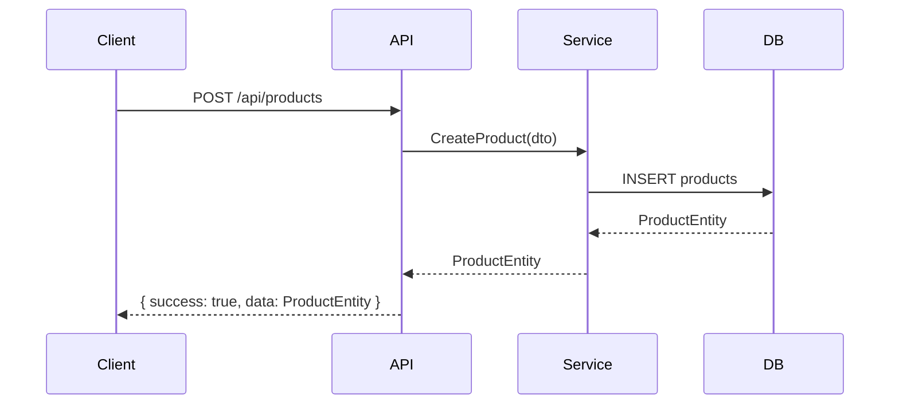
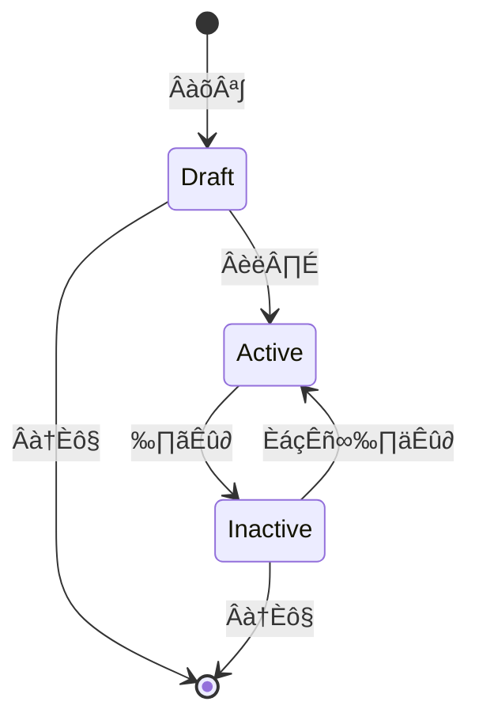

**Default Tech Stack Context**: 
- Default: Node.js + Hono + Drizzle + SQLite + Vue 3 + Vite
- Unless user explicitly overrides, enforce this stack in all outputs

Load `references/mvp-tech-stack-default.md` for full specification.


# MVP Spec Generator ‚Ä?ÊäÄÊúØËßÑʆºÁîüÊàêÊäÄËÉ?

> **Core Belief**: Spec-first is not documentation-first. The spec is a design artifact that enables code generation. A good spec makes implementation mechanical.

**Division of Labor**: This Skill focuses on **spec document generation** based on PRD. It extends kf-mvp-arch-expert with additional generation patterns. Follows Generator pattern with strict templates.

---

# Core Philosophy

Derived from Kiro IDE Spec Document Generation best practices:

1. **Spec is a design tool** ‚Ä?Not documentation, but a specification that enables generation
2. **Complete before code** ‚Ä?All decisions made in spec, code is mechanical implementation
3. **Single source of truth** ‚Ä?Spec is authoritative for both frontend and backend
4. **Testable specifications** ‚Ä?Every spec item should have corresponding test cases

---

# Output Artifacts

## Primary Outputs

| Artifact | Purpose | Format |
|----------|---------|--------|
| `spec.md` | Technical architecture | Markdown |
| `schema.sql` | Database schema | SQL / Drizzle |
| `api-contract.yaml` | API contracts | OpenAPI 3.0 |
| `<module>.md` | Module specifications | Markdown |

## Secondary Outputs

| Artifact | Purpose | Format |
|----------|---------|--------|
| `data-flow.md` | Data flow diagrams | Mermaid |
| `state-machines.md` | Entity state diagrams | Mermaid |
| `error-codes.md` | Error code registry | YAML |

---

# Stage 1: PRD Analysis

## Extract Core Entities

```markdown
## PRD实体提取

| 实体 | 类型 | 属性数 | 关系 |
|------|------|--------|------|
| User | 核心 | 8 | 1:N Org |
| Product | 核心 | 12 | N:1 Category |
| TraceCode | 核心 | 6 | N:1 Product |
```

## Extract Business Rules

```markdown
## 业务规则

| 规则ID | 描述 | 涉及实体 | 约束类型 |
|--------|------|----------|----------|
| BR-001 | Ê∫ØÊ∫êÁ†ÅʆºÂºèÔºöÂÖ¨Âè∏Á†?Êó•Êúü+ʵÅÊ∞¥Âè?| TraceCode | ʆºÂºè |
| BR-002 | Áî®Êà∑ËßíËâ≤Âè™ËÉΩÊò?admin/user/brand | User | Êûö‰∏æ |
| BR-003 | 产品必须关联类目 | Product | 必填 |
```

---

# Stage 2: Schema Design

## Drizzle Schema Template

```typescript
// schema.ts
import { sqliteTable, text, integer } from 'drizzle-orm/sqlite-core';

// Users Table
export const users = sqliteTable('users', {
  id: integer('id').primaryKey({ autoIncrement: true }),
  email: text('email').notNull().unique(),
  passwordHash: text('password_hash').notNull(),
  role: text('role', { enum: ['admin', 'user', 'brand'] }).notNull().default('user'),
  organizationId: integer('organization_id'),
  createdAt: text('created_at').notNull().default('CURRENT_TIMESTAMP'),
  updatedAt: text('updated_at').notNull().default('CURRENT_TIMESTAMP'),
  deletedAt: text('deleted_at'),
});

// Products Table
export const products = sqliteTable('products', {
  id: integer('id').primaryKey({ autoIncrement: true }),
  name: text('name').notNull(),
  description: text('description'),
  categoryId: integer('category_id').references(() => categories.id),
  organizationId: integer('organization_id').references(() => organizations.id),
  createdAt: text('created_at').notNull().default('CURRENT_TIMESTAMP'),
  updatedAt: text('updated_at').notNull().default('CURRENT_TIMESTAMP'),
  deletedAt: text('deleted_at'),
});
```

---

# Stage 3: API Contract Generation

## OpenAPI Template

```yaml
# api-contract.yaml
openapi: 3.0.0
info:
  title: ${PROJECT_NAME} API
  version: 1.0.0
  description: Auto-generated from PRD

servers:
  - url: /api
    description: Development server

paths:
  /auth/login:
    post:
      summary: 用户登录
      tags: [Auth]
      requestBody:
        required: true
        content:
          application/json:
            schema:
              $ref: '#/components/schemas/LoginRequest'
      responses:
        '200':
          description: 登录成功
          content:
            application/json:
              schema:
                $ref: '#/components/schemas/LoginResponse'
        '401':
          $ref: '#/components/responses/Unauthorized'

components:
  schemas:
    LoginRequest:
      type: object
      required: [email, password]
      properties:
        email:
          type: string
          format: email
        password:
          type: string

    LoginResponse:
      type: object
      properties:
        success:
          type: boolean
        data:
          type: object
          properties:
            token:
              type: string
            user:
              $ref: '#/components/schemas/User'

    User:
      type: object
      properties:
        id:
          type: integer
        email:
          type: string
        role:
          type: string
          enum: [admin, user, brand]

  responses:
    Unauthorized:
      description: Êú™ÊéàÊù?
      content:
        application/json:
          schema:
            type: object
            properties:
              success:
                type: boolean
                example: false
              error:
                type: object
                properties:
                  code:
                    type: string
                  message:
                    type: string
```

---

# Stage 4: Module Spec Generation

For each module, generate `<module>.md`:

```markdown
# {Module} Module Specification

## Overview
[Brief description]

## Interfaces
| Method | Path | Auth | Description |
|--------|------|------|-------------|
| GET | /api/{module} | Yes | List |
| GET | /api/{module}/:id | Yes | Get |
| POST | /api/{module} | Yes | Create |
| PUT | /api/{module}/:id | Yes | Update |
| DELETE | /api/{module}/:id | Yes | Delete |

## Data Model
| Field | Type | Constraints |
|-------|------|-------------|
| id | INTEGER | PK, AUTO |
| name | TEXT | NOT NULL |
| created_at | DATETIME | NOT NULL |

## Acceptance Criteria
1. [Criterion 1]
2. [Criterion 2]

## Error Codes
| Code | HTTP | Description |
|------|------|-------------|
| NOT_FOUND | 404 | Resource not found |
| VALIDATION_ERROR | 400 | Invalid input |
```

---

# Stage 5: Data Flow Diagrams



---

# Stage 6: State Machine Generation



---

# Integration with Other Skills

| Skill | Input To | Output From |
|-------|---------|-------------|
| kf-mvp-prd-generator | PRD | Requirements |
| kf-mvp-biz-expert | Spec + PRD | Module specs |
| kf-mvp-mock-service | api-contract.yaml | Mock server |
| kf-mvp-test-single | <module>.md | Test cases |
| kf-mvp-backend-tdd | schema + api-contract | Implementation |

---

# Constraints

**MUST DO:**
- Follow spec-first methodology
- Generate from PRD, not imagination
- Use consistent naming
- Include error codes
- Document state machines

**MUST NOT DO:**
- Add features not in PRD
- Skip any entity from PRD
- Use non-standard naming
- Leave ambiguous definitions

---

# Gotchas

- **Spec is source of truth** ‚Ä?Once locked, changes require formal process
- **Naming consistency** ‚Ä?Use same terms across all artifacts
- **Completeness** ‚Ä?Every entity must have all properties listed
- **Testability** ‚Ä?Every spec item must have corresponding test
- **Iteration** ‚Ä?Spec evolves with PRD understanding