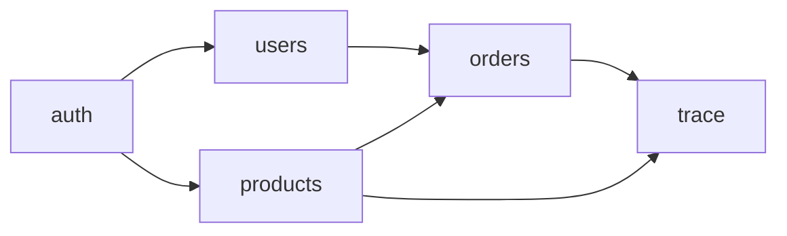

**Default Tech Stack Context**: 
- Backend: Node.js + Hono + Drizzle ORM + SQLite
- Frontend: Vue 3 + Vite + Pinia + Vue Router + Axios
- Testing: Vitest + Playwright
- Third-party: ALL Mock

Load `references/mvp-tech-stack-default.md` for full specification.


# MVP Task Splitter — 任务拆分技能

> **Core Belief**: Good task decomposition makes parallel development possible. The key is finding the right granularity: atomic enough to parallelize, cohesive enough to be meaningful.

**Division of Labor**: This Skill focuses on **task breakdown and module organization** using pipeline and inversion patterns. It extends kf-mvp-biz-expert with structured WBS (Work Breakdown Structure).

---

# Core Philosophy

1. **Atomic tasks** — Each task should be completable by one agent in one session
2. **Clear dependencies** — Know what must complete before what can start
3. **Testable** — Every task should have clear acceptance criteria
4. **Measurable** — Progress should be trackable

---

# Task Decomposition Levels

## Level 1: Stage (宏观阶段)
- Stage1: 需求对齐
- Stage2: 计划
- Stage3: 执行
- Stage4: 集成

## Level 2: Phase (阶段)
- 架构设计
- 业务拆分
- 拷问审查
- Mock开发

## Level 3: Module (模块)
- user模块
- product模块
- trace模块

## Level 4: Task (任务)
- 实现用户登录接口
- 编写用户模块单元测试

## Level 5: Subtask (子任务)
- 实现JWT token验证
- 实现密码加密存储

---

# WBS Template

```markdown
# Work Breakdown Structure

## 1. 需求阶段
1.1 PRD生成
  1.1.1 需求访谈
  1.1.2 PRD文档编写
  1.1.3 PRD评审

## 2. 计划阶段
2.1 架构设计
  2.1.1 Schema设计
  2.1.2 API契约定义
  2.1.3 技术选型
  
2.2 业务拆分
  2.2.1 模块识别
  2.2.2 依赖分析
  2.2.3 验收标准制定
  
2.3 拷问审查
  2.3.1 需求覆盖检查
  2.3.2 边界一致性检查

## 3. 执行阶段
3.1 后端开发
  3.1.1 [模块名]
    3.1.1.1 实现API接口
    3.1.1.2 编写单元测试
    3.1.1.3 代码审查
  
3.2 前端开发
  3.2.1 [页面名]
    3.2.1.1 组件开发
    3.2.1.2 页面集成

## 4. 集成阶段
4.1 集成测试
4.2 缺陷修复
4.3 验收确认
```

---

# Module Identification Process

## Step 1: Entity Extraction
```markdown
## 核心业务实体

| 实体 | 说明 | 优先级 |
|------|------|--------|
| User | 系统用户 | P0 |
| Organization | 组织 | P0 |
| Product | 产品 | P1 |
| Category | 类目 | P1 |
```

## Step 2: Module Grouping
```markdown
## 模块分组

### 认证与权限
- auth (认证)
- users (用户管理)
- roles (角色管理)
- organizations (组织管理)

### 业务核心
- products (产品管理)
- categories (类目管理)
- orders (订单管理)

### 工具与配置
- templates (模板管理)
- trace (溯源管理)
- codes (码段管理)
```

## Step 3: Dependency Analysis
```markdown
## 依赖矩阵

| 模块 | 依赖 | 被依赖 |
|------|------|--------|
| auth | - | 所有模块 |
| users | auth, org | product, order |
| products | users, category | trace |
| trace | product, template | - |
```

---

# Task Card Template

```markdown
## Task Card: [Task Name]

**Task ID**: TASK-[模块]-[序号]
**Module**: [module]
**Stage**: [stage]
**Priority**: P0/P1/P2/P3

### 描述
[Clear description of what needs to be done]

### 输入
- [ ] [input file/artifact]

### 输出
- [ ] [output file/artifact]

### 验收标准
1. [AC1]
2. [AC2]
3. [AC3]

### 依赖任务
- TASK-XXX (必须完成)

### 估计工时
[X] hours

### 执行者
[Agent role]

### 状态
- [ ] 未开始
- [ ] 进行中
- [ ] 完成
```

---

# Module Definition Template

```markdown
# [Module] Module Specification

## 基本信息
- **模块名**: [module]
- **领域**: [认证与权限/业务核心/工具与配置]
- **优先级**: P0/P1/P2
- **开发顺序**: [N]

## 职责边界

### 本模块负责
- [ ] [功能A]
- [ ] [功能B]

### 本模块不负责
- [ ] [功能X] (由 [模块Y] 负责)
- [ ] [功能Y] (由 [模块Z] 负责)

## 依赖关系
```
[module] --> [依赖模块1]
[module] --> [依赖模块2]
[依赖模块] --> [module]
```

## 接口清单

| 方法 | 路径 | 功能 | 权限 |
|------|------|------|------|
| GET | /api/[module] | 列表 | [角色] |
| GET | /api/[module]/:id | 详情 | [角色] |
| POST | /api/[module] | 创建 | [角色] |
| PUT | /api/[module]/:id | 更新 | [角色] |
| DELETE | /api/[module]/:id | 删除 | [角色] |

## 数据模型

| 字段 | 类型 | 约束 | 说明 |
|------|------|------|------|
| id | INTEGER | PK | 主键 |
| [field1] | TEXT | NOT NULL | [说明] |
| [field2] | INTEGER | FK | [说明] |

## 验收标准

### Happy Path
1. [ ] [AC1]
2. [ ] [AC2]

### Exception Path
1. [ ] [AC1]
2. [ ] [AC2]

### 边界值
1. [ ] [AC1]
2. [ ] [AC2]
```

---

# Dependency Graph Format



Or in structured format:

```yaml
# dependencies.yaml
modules:
  - name: auth
    dependencies: []
    dependents: [users, products, orders, trace]
    
  - name: users
    dependencies: [auth, org]
    dependents: [products, orders]
    
  - name: products
    dependencies: [auth, users, category]
    dependents: [trace]
    
  - name: category
    dependencies: [auth]
    dependents: [products]
    
  - name: orders
    dependencies: [auth, users, products]
    dependents: [trace]
    
  - name: trace
    dependencies: [auth, products, orders]
    dependents: []
```

---

# Task Prioritization

## Priority Matrix

| 优先级 | 定义 | 示例 |
|--------|------|------|
| P0 | 必须完成，否则其他工作无法进行 | 认证模块 |
| P1 | 核心功能，影响用户体验 | CRUD模块 |
| P2 | 重要功能，可延迟 | 报表功能 |
| P3 |Nice to have | 高级特性 |

## Scheduling Order

```
Round 1: P0 modules without dependencies
Round 2: P0 modules with all dependencies complete
Round 3: P1 modules
Round 4: P2 modules
Round 5: P3 modules
```

---

# Output: task.md Template

```markdown
# Task List for [Project Name]

> **Version**: 1.0
> **Generated**: [Date]
> **Based on**: [PRD reference]

---

## Executive Summary

| 指标 | 数值 |
|------|------|
| 总模块数 | [N] |
| 总任务数 | [N] |
| 关键路径长度 | [N] 轮 |
| 最大并行度 | [N] agents |

---

## Module Summary

| 模块 | 领域 | 优先级 | 依赖 | 开发顺序 |
|------|------|--------|------|----------|
| [module1] | [domain] | P0 | - | 1 |
| [module2] | [domain] | P1 | [module1] | 2 |

---

## Dependency Graph

```mermaid
graph LR
    [dependency graph]
```

---

## Task Breakdown

### Module: [module1]

#### Task: TASK-[module1]-001
[See Task Card Template]

#### Task: TASK-[module1]-002
[See Task Card Template]

---

## Development Schedule

| Round | Modules | Parallel Agents |
|-------|---------|----------------|
| 1 | [modules] | [N] |
| 2 | [modules] | [N] |
| 3 | [modules] | [N] |
```

---

# Integration with Other Skills

| Skill | Input To | Output From |
|-------|---------|-------------|
| kf-mvp-prd-generator | - | Requirements |
| kf-mvp-spec-generator | task.md | Technical spec |
| kf-pipeline-coordinator | task.md | Scheduling |
| kf-mvp-test-single | <module>.md | Tests |

---

# Constraints

**MUST DO:**
- Identify all modules from PRD
- Ensure no circular dependencies
- Assign correct priorities
- Define clear acceptance criteria

**MUST NOT DO:**
- Create modules without clear boundaries
- Have hidden dependencies
- Leave acceptance criteria vague
- Skip domain classification

---

# Gotchas

- **Module size** — Too large = hard to parallelize; too small = overhead
- **Dependency direction** — "A depends on B" means B must complete first
- **Priority vs Order** — Priority is business value; order is technical dependency
- **Cross-module = scenario** — If task spans modules, it's a scenario test (③b-2)
- **Domain affinity** — Same-domain modules can be developed in parallel