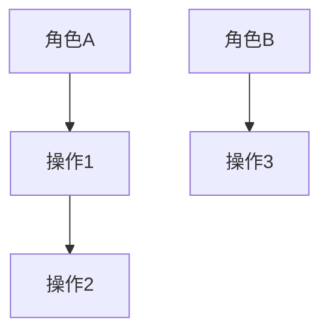
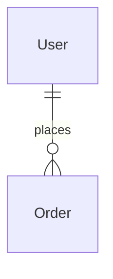

# PRD 文档标准模板

> 本文档为 `kf-mvp-prd-generator` 的 Phase 1 章节结构模板。
> 生成 PRD 时 MUST 按此结构输出，不得跳过任何章节。

---

# [产品名称] — 产品需求文档 (PRD)

> **版本**: v1.0  
> **创建日期**: YYYY-MM-DD  
> **状态**: 初版 / 锁定版  
> **关联文档**: spec.md / schema.sql / api-contract.yaml

---

## Chapter 1: 项目背景 🔴

### 1.1 业务目标
_回答"为什么做"，至少包含一个可量化的业务指标。_

**目标**：[描述核心业务目标]

**成功指标**：
| 指标 | 当前值 | 目标值 | 测量方式 |
|------|--------|--------|----------|

### 1.2 目标用户角色
| 角色 | 描述 | 核心诉求 |
|------|------|----------|

### 1.3 产品类型判定
- **类型**：B2C / B2B / 内部工具 / 平台型
- **判定理由**：

---

## Chapter 2: 术语定义 🟢

| 术语 | 英文 | 定义 | 备注 |
|------|------|------|------|

> **铁律**：此处定义的术语在全文 must 统一使用，禁止混用同义词。

---

## Chapter 3: 风险与约束 🟡

### 3.1 业务风险（≥ 3 条）
| 风险 | 影响 | 概率 | 应对 |
|------|------|------|------|

### 3.2 技术约束
| 维度 | 约束 | 版本号 |
|------|------|--------|
| 后端框架 | Hono | 4.x |
| 前端框架 | Vue 3 | 3.4+ |
| UI 组件库 | [见 mvp-tech-stack-default] | - |
| 数据库 | SQLite (better-sqlite3) | 11.x |
| ORM | Drizzle ORM | 0.36+ |
| 构建工具 | Vite | 5.x |
| 测试框架 | Vitest | 2.x |

### 3.3 Out of Scope（不做事项）
| # | 事项 | 原因 |
|---|------|------|

### 3.4 合规约束（条件章节）
_仅当项目涉及监管合规时填写，否则标注"不适用"。_

---

## Chapter 4: 业务主流程 🟢

> **铁律**：每条业务线 MUST 独立成节。

### FLOW-01: [业务线名称]

**涉及角色**：[角色列表]

| 阶段 | 角色 | 操作 | 产生的数据 |
|------|------|------|-----------|

**泳道图**（跨角色时）：


---

## Chapter 5: ER 关系 🟢

### 5.1 实体列表
| 实体名 | 含义 | 主要属性 |
|--------|------|----------|

### 5.2 实体关系图


### 5.3 关系说明表
| 实体A | 关系 | 实体B | 业务约束 |
|-------|------|-------|----------|

---

## Chapter 6: 功能需求 🔴🟡

### 6.0 功能清单
| 客户端 | 一级模块 | 二级功能 | 三级功能 | 对应页面 | 对应按钮/操作 |
|--------|---------|---------|---------|---------|-------------|

### 6.1 ~ 6.N: 按页面/模块组织

每个功能点按以下 8 维度输出：

```
#### F-XXX 功能名称 `P0|P1|P2`

**维度1 — 描述**（≥30字符）：
**维度2 — 验收标准**（Gherkin Given-When-Then）：
**维度3 — 业务规则**（IF-THEN 格式）：
**维度4 — 交互模式**（用户操作 → 系统响应）：
**维度5 — 状态流转**（stateDiagram-v2 或 "不适用"）：
**维度6 — 字段规格**（按页面类型输出）：
**维度7 — 数据校验规则**（≥2条）：
**维度8 — 数据权限**（权限表 或 "不适用 — 全系统共享"）：
```

---

## Chapter 7: 复杂/核心业务专题 🔴

_仅对 Q5 指定的复杂模块输出，每个模块一个专题，包含 9 个子章节：_
1. 功能来源与渠道分析
2. 使用角色及职责
3. 完整操作流程（准备→执行→校验→后续）
4. 状态流转说明（状态机图 + 映射表）
5. 数据关联关系（上游 + 下游）
6. 数据流转关系总图（Mermaid）
7. 页面字段汇总
8. 报表统计（如适用）
9. 智能规则/默认匹配逻辑（如适用）

---

## Chapter 8: 核心实体状态图 🔴

对涉及复杂状态的实体逐个输出：
- 状态列表
- 状态流转图（stateDiagram-v2，含异常回退）
- 状态-操作-权限映射表
- 状态变更副作用

---

## Chapter 9: 验收标准 🟡

### 9.1 集成测试场景
**Happy Path**（≥ 业务线数）：
```gherkin
Scenario: INT-HP-001 - [名称] (P0)
  Given [前置条件]
  When [操作]
  Then [预期结果] (Frontend/Backend)
```

**Exception Path**（≥ 5 条）：
```gherkin
Scenario: INT-EP-001 - [名称] (P0)
  Given [前置条件]
  And [异常条件]
  When [触发异常]
  Then [错误处理] (Frontend/Backend)
```

### 9.2 异常处理与边界值表
| 编号 | 异常场景 | 边界值定义 | 预期处理 | 对应功能点 |
|------|---------|-----------|---------|-----------|

---

> **人/AI 标记说明**：🔴 人重点关注 | 🟡 AI实现参考 | 🟢 人/AI共同
