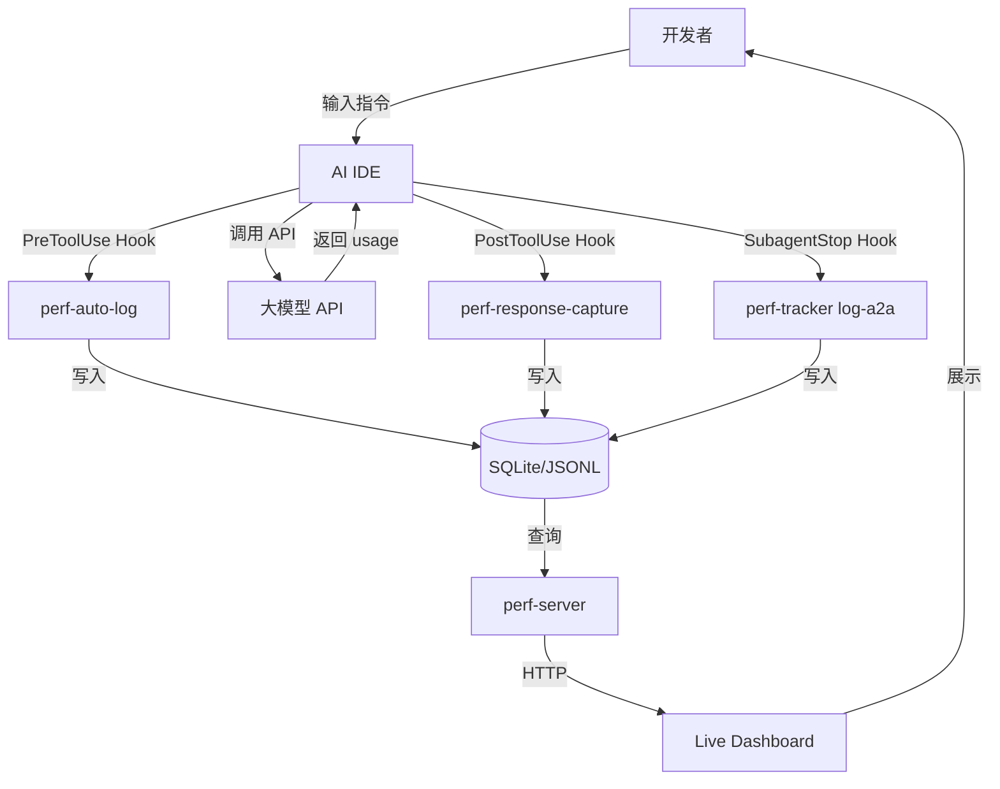
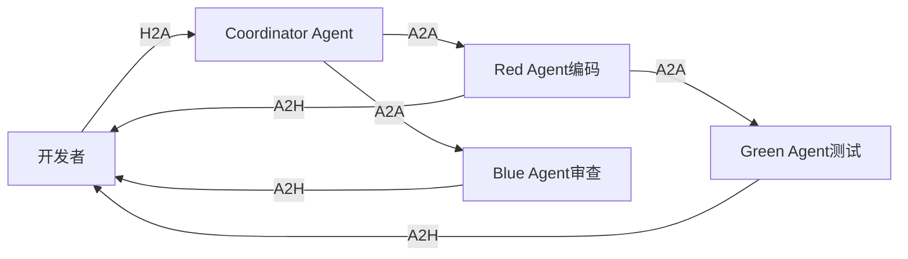
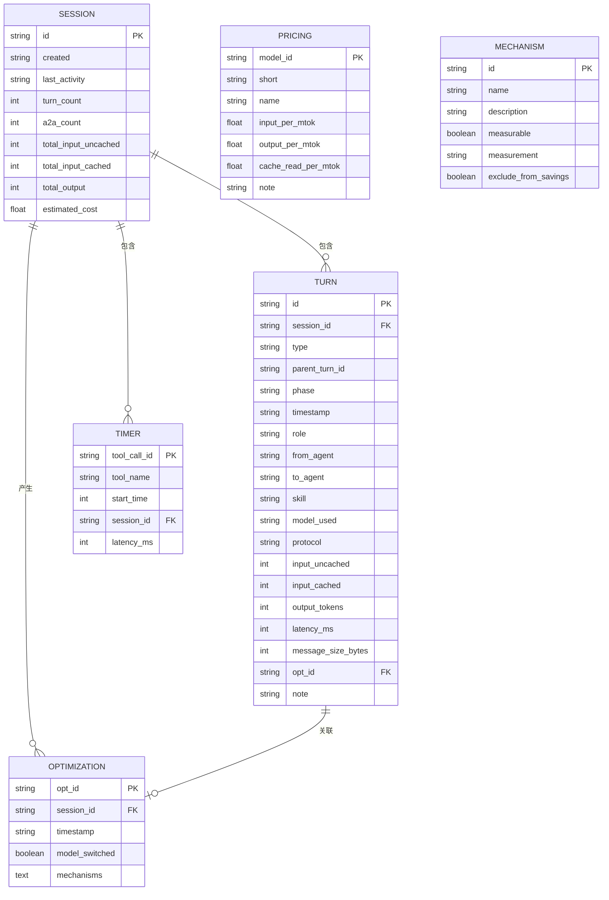
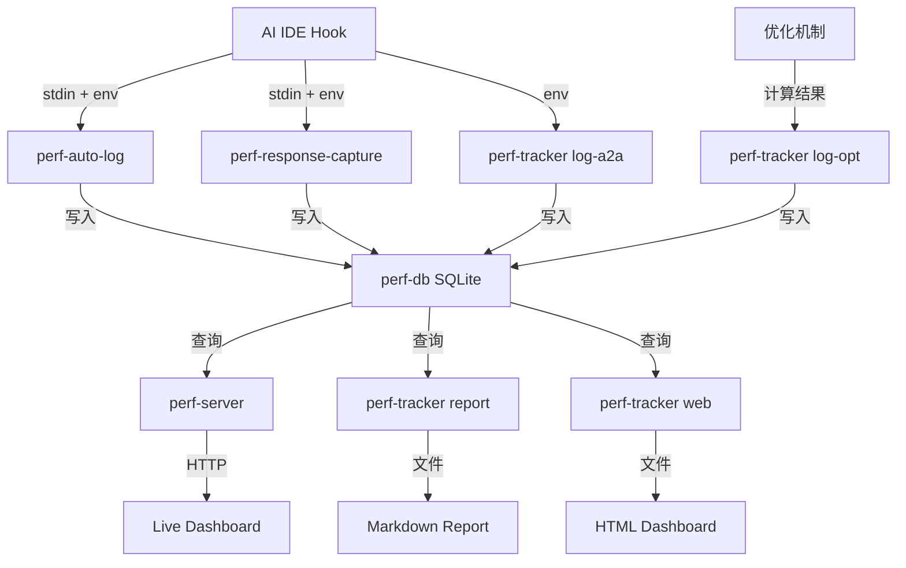
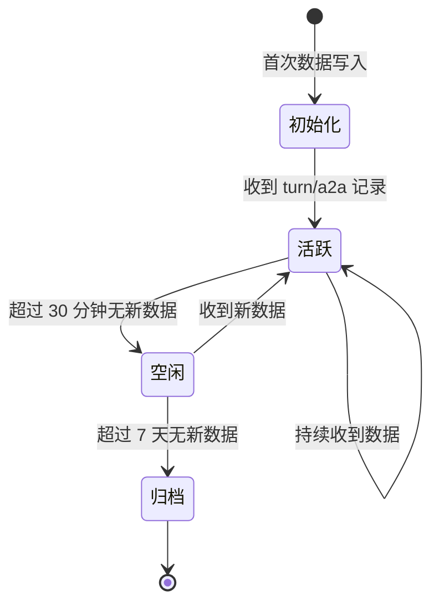

# Qoder Monitor — AI 执行追踪与性能监控平台 PRD

## 文档信息

| 字段 | 值 |
|------|-----|
| 版本 | v0.1 |
| 作者 | KF |
| 创建日期 | 2026-05-20 |
| 最后更新 | 2026-05-20 |
| 状态 | 草稿 |
| 产品类型 | 内部工具 |

---

## 1. 项目背景 🔴（人重点关注：业务决策与目标确认）

### 1.1 业务目标

- **核心问题**：当前 AI 辅助开发（Claude Code / Qoder）过程中，Token 消耗、成本支出、A2A 通信开销完全不可见，导致无法评估优化策略效果，也无法控制预算风险。
- **目标用户**：使用 AI IDE（Claude Code / Qoder）进行软件开发的个人开发者和技术团队。
- **核心价值**：提供实时的 AI 调用追踪、Token 消耗统计、成本估算和优化节省量化，让开发者"看见"每一次 AI 交互的真实代价。
- **量化指标**：
  - 监控覆盖率：100% 的人机对话轮次和 A2A 消息被记录
  - 成本估算准确度：与实际账单误差不超过 15%
  - 优化节省可量化：6 大优化机制各节省 Token 数可独立统计
  - 数据延迟：从 AI 调用完成到看板展示不超过 5 秒

### 1.2 目标用户角色

| 角色 | 描述 | 核心诉求 |
|------|------|---------|
| 个人开发者 | 独立使用 AI IDE 进行开发的工程师 | 了解自己的 Token 消耗和成本，优化使用习惯 |
| 技术团队负责人 | 管理多人使用 AI IDE 的团队 Lead | 掌握团队整体 AI 使用成本和效率，制定使用规范 |
| 平台运维人员 | 维护 AI 开发平台基础设施的工程师 | 监控系统健康状态，排查数据采集异常 |

---

## 2. 术语定义 🟢（人/AI共同：术语一致性检查）

> **铁律**：本章定义的术语，全文 MUST 统一使用。禁止混用同义词。

| 术语 | 英文 | 定义 | 备注 |
|------|------|------|------|
| 轮次 | Turn | 一次完整的人机对话交互，包含用户提问和 AI 回复 | 分为 H2A（人→AI）和 A2H（AI→人）两种方向 |
| A2A 消息 | A2A Message | Agent 与 Agent 之间的通信消息 | 多 Agent 协作时产生，如 Coordinator 分配任务给 Subagent |
| Token | Token | 大语言模型处理文本的基本单位 | 分为输入 Token（未命中/缓存）和输出 Token |
| 缓存命中 | Cache Hit | 输入内容前缀与之前请求匹配，触发模型 KV 缓存复用 | 缓存 Token 按更低单价计费 |
| 优化节省 | Optimization Savings | 通过各种优化机制减少的 Token 消耗量 | 不含模型切换带来的成本节省 |
| 会话 | Session | 一次连续的 AI 开发工作会话 | 由 session_id 唯一标识，包含多个轮次和 A2A 消息 |
| 阶段 | Phase | 会话中的任务阶段标识 | 如 Phase 1（需求分析）、Phase 2（编码实现）等 |
| 优化机制 | Optimization Mechanism | 减少 Token 消耗的技术手段 | 当前定义 7 种：lean_ctx、L1_cache、L2_warmup、L3_skill_stub、CCP_skip、lambda_lang、model_switch |
| 模型切换 | Model Switch | 根据任务复杂度在 Pro 模型和 Flash 模型之间自动切换 | 属于成本优化，不计入 Token 节省 |
| 实时看板 | Live Dashboard | 自动刷新（每 5 秒）的 Web 页面，展示当前会话的监控数据 | 由 perf-server 提供 HTTP 服务 |
| Hook | Hook | AI IDE 在特定生命周期阶段触发的外部脚本调用 | 如 PreToolUse、PostToolUse、SubagentStop 等 |

---

## 3. 风险与约束 🔴🟡（风险→人确认，技术约束→AI参考）

### 3.1 业务风险 🔴（人重点关注：风险判断）

| 编号 | 风险描述 | 影响范围 | 缓解措施 |
|------|---------|---------|---------|
| R-001 | Qoder Hook 系统元数据能力不确定，可能无法获取 Token、Agent 名称等关键数据 | 数据采集模块（perf-auto-log、perf-response-capture） | 设计多源降级策略：环境变量 → stdin hook 数据 → 文件读取 → 空值兼容 |
| R-002 | 模型定价频繁变动，成本估算可能偏离实际账单 | 成本估算模块 | 定价数据外置到 pricing.json，支持热更新；定期从官方 API 同步 |
| R-003 | 会话碎片化导致数据无法聚合分析 | 会话管理和数据统计 | 统一 session_id 生成逻辑，支持环境变量注入和文件持久化 |
| R-004 | better-sqlite3 在 Windows 环境编译失败 | 数据存储层 | 备选 sql.js（纯 WASM）；保留 JSONL 双写作为降级方案 |
| R-005 | A2A 消息监控依赖 SubagentStop hook，若 Qoder 不支持则无法采集 | A2A 监控模块 | 先确认 Qoder hook 能力边界；如不支持则标记为已知限制 |

### 3.2 技术约束 🟡（AI实现参考：版本与框架约束）

| 维度 | 约束 | 版本号 |
|------|------|--------|
| 运行时 | Node.js | >= 18 LTS |
| 后端框架 | Hono | 4.x |
| 前端框架 | Vue 3 | 3.4+ |
| UI 组件库 | Element Plus | 2.x |
| 数据库 | SQLite (better-sqlite3) | 11.x |
| ORM | Drizzle ORM | 0.36+ |
| 构建工具 | Vite | 5.x |
| 测试框架 | Vitest | 2.x |

> 注：当前 qoder-monitor 为纯 Node.js CLI 工具集，本期 PRD 规划将其升级为 Web 平台（Hono + Vue 3）。

### 3.3 Out of Scope 🔴（人重点关注：范围边界确认）

| 编号 | 事项 | 原因 | 后续计划 |
|------|------|------|---------|
| OS-001 | 多用户权限管理与 RBAC | 当前为个人/单团队使用场景，无多租户需求 | v2.0 引入团队版时实现 |
| OS-002 | 实时告警与通知（邮件/钉钉/Slack） | MVP 阶段聚焦数据采集和展示 | v1.5 引入成本阈值告警 |
| OS-003 | 与第三方账单系统对接（如 DeepSeek 官方账单 API） | 各厂商账单 API 不统一，且需要 API Key | v2.0 评估接入可行性 |
| OS-004 | 历史数据趋势分析与预测 | 需要积累至少 30 天数据才有分析价值 | v1.5 引入周报/月报时实现 |
| OS-005 | 移动端适配 | 主要使用场景为桌面端开发 | v2.0 评估移动端需求 |
| OS-006 | Redis / 消息队列 / 限流 | MVP 明确豁免组件 | 不予引入 |
| OS-007 | XSS/CSRF 防护（超出 JWT 基础认证） | MVP 明确豁免 | 团队版时引入完整安全方案 |

### 3.4 合规约束（条件章节）

> 本期项目不涉及监管合规要求（无 GDPR、等保、行业准入等约束）。settings.local.json 中的 API Key 由用户本地管理，监控脚本不采集、不传输敏感凭据。

---

## 4. 业务主流程 🟢（人/AI共同：流程确认与AI细化）

> **铁律**：每条业务线 MUST 独立成节。

### 4.1 业务线A：AI 调用数据采集

- **流程编号**：FLOW-01
- **涉及角色**：开发者（用户）、AI IDE（Claude Code / Qoder）、监控平台（qoder-monitor）

| 阶段 | 角色 | 操作 | 产生的业务数据 |
|------|------|------|--------------|
| 1. 用户输入 | 开发者 | 在 AI IDE 中输入自然语言指令 | 用户消息内容、消息大小（字节）、当前模型、阶段标识 |
| 2. Hook 触发 | AI IDE | PreToolUse 阶段触发 perf-auto-log | turn 记录（type=turn, role=human）写入 turns 表 |
| 3. AI 处理 | AI IDE | 调用大模型 API 生成回复 | API 返回 usage 数据（input_tokens, output_tokens, cache_read_input_tokens） |
| 4. 回复采集 | AI IDE | PostToolUse 阶段触发 perf-response-capture | turn 记录（type=turn, role=ai）写入 turns 表，含真实 Token 数据 |
| 5. 优化记录 | 监控平台 | 记录各优化机制的节省数据 | optimization 记录写入 opts 表 |
| 6. 实时展示 | 监控平台 | perf-server 每 5 秒刷新看板 | HTML Dashboard 展示最新数据 |



### 4.2 业务线B：A2A 消息监控

- **流程编号**：FLOW-02
- **涉及角色**：Coordinator Agent、Subagent、监控平台

| 阶段 | 角色 | 操作 | 产生的业务数据 |
|------|------|------|--------------|
| 1. 任务分配 | Coordinator | 将子任务分配给 Subagent | from_agent=coordinator, to_agent=subagent |
| 2. Hook 触发 | AI IDE | SubagentStop 阶段触发 perf-tracker log-a2a | a2a 记录（type=a2a）写入 turns 表 |
| 3. 子任务执行 | Subagent | 执行编码/测试/审查等任务 | 可能产生多轮 H2A 交互（被 FLOW-01 记录） |
| 4. 结果返回 | Subagent | 将结果返回 Coordinator | 可能触发新一轮 A2A 记录 |
| 5. 流图生成 | 监控平台 | 聚合 A2A 数据生成 Agent 间通信流图 | Sankey 风格可视化 |



### 4.3 业务线C：成本分析与优化评估

- **流程编号**：FLOW-03
- **涉及角色**：开发者、监控平台

| 阶段 | 角色 | 操作 | 产生的业务数据 |
|------|------|------|--------------|
| 1. 数据聚合 | 监控平台 | 按模型、会话、时间段聚合 Token 数据 | 模型分布统计、会话统计 |
| 2. 成本计算 | 监控平台 | 根据 pricing.json 定价计算估算成本 | 单轮成本、会话总成本、模型级成本 |
| 3. 节省计算 | 监控平台 | 汇总各优化机制的 Token 节省量 | lean_ctx、L1_cache 等机制节省明细 |
| 4. 报告生成 | 开发者 | 执行 perf-tracker report 命令 | Markdown 格式报告文件 |
| 5. 看板浏览 | 开发者 | 浏览器访问 Live Dashboard | 实时可视化数据展示 |

---

## 5. ER 关系 🟢（人/AI共同：实体关系确认）

### 5.1 核心实体

| 实体名 | 含义 | 主要属性 |
|--------|------|---------|
| Turn | 单次人机对话轮次或 A2A 消息记录 | id, session_id, type, role, model_used, tokens, timestamp, phase, note |
| Session | 一次连续的 AI 开发工作会话 | id, created, last_activity, turn_count, a2a_count, total_input_uncached, total_input_cached, total_output, estimated_cost |
| Optimization | 某一轮次的优化节省明细 | opt_id, session_id, timestamp, model_switched, mechanisms |
| Pricing | 模型定价配置 | model_id, input_per_mtok, output_per_mtok, cache_read_per_mtok, currency |
| Mechanism | 优化机制定义 | id, name, description, measurable, measurement, exclude_from_savings |
| Timer | 工具调用耗时记录 | tool_call_id, tool_name, start_time, session_id, latency_ms |

### 5.2 ER 图



### 5.3 关系说明

| 实体A | 关系 | 实体B | 业务约束 |
|--------|------|--------|----------|
| Session | 1:N | Turn | 一个会话包含多条轮次记录；type 区分 turn（人机）和 a2a（Agent间） |
| Session | 1:N | Optimization | 一个会话产生多条优化记录；按 opt_id 关联到具体轮次 |
| Turn | N:1 | Optimization | 多条轮次可关联同一优化记录（如批量优化） |
| Session | 1:N | Timer | 一个会话包含多个工具调用耗时记录 |
| Pricing | 独立 | - | 定价数据为配置表，与 Turn 通过 model_used 字段逻辑关联 |
| Mechanism | 独立 | - | 机制定义为配置表，与 Optimization 通过 mechanisms JSON 字段逻辑关联 |

---

## 6. 功能需求 🟢（人/AI共同）

> **本章是 PRD 的灵魂。每个功能点 = 一个完整规格块，MUST 包含全部 8 个维度。**

### 6.0 功能清单

| 客户端 | 一级模块 | 二级功能 | 三级功能 | 对应页面 | 对应按钮/操作 |
|--------|---------|---------|---------|---------|-------------|
| Web端 | 数据采集 | 人机轮次采集 | 用户输入记录 | 无（Hook自动） | PreToolUse Hook |
| Web端 | 数据采集 | 人机轮次采集 | AI回复记录 | 无（Hook自动） | PostToolUse Hook |
| Web端 | 数据采集 | A2A消息采集 | Agent间通信记录 | 无（Hook自动） | SubagentStop Hook |
| Web端 | 数据采集 | 优化节省采集 | 多机制节省记录 | 无（Hook/手动） | log-opt 命令 |
| Web端 | 数据存储 | SQLite存储 | 结构化数据持久化 | 无 | 自动双写 |
| Web端 | 数据存储 | JSONL降级 | 纯文本备份 | 无 | 自动双写 |
| Web端 | 实时监控 | Live Dashboard | 实时看板展示 | Dashboard页 | 浏览器访问 |
| Web端 | 实时监控 | 会话列表 | 多会话管理 | Dashboard页 | 会话筛选 |
| Web端 | 统计分析 | Token统计 | 输入/输出/缓存统计 | Dashboard页 | 自动聚合 |
| Web端 | 统计分析 | 成本估算 | 按模型成本计算 | Dashboard页 | 自动计算 |
| Web端 | 统计分析 | 优化节省 | 各机制节省汇总 | Dashboard页 | 自动聚合 |
| Web端 | 统计分析 | 模型分布 | 各模型使用统计 | Dashboard页 | 自动聚合 |
| Web端 | 报告生成 | Markdown报告 | 会话级报告导出 | 无 | report 命令 |
| Web端 | 报告生成 | HTML看板 | 独立可视化文件 | 无 | web 命令 |
| Web端 | 系统管理 | 数据重置 | 清空监控数据 | 无 | reset 命令 |
| Web端 | 系统管理 | 模型定价 | 定价配置查看 | Dashboard页 | models 命令 |
| Web端 | 系统管理 | 守护进程 | 后台服务管理 | 无 | daemon start/stop |
| Web端 | 数据同步 | 转录同步 | Claude Code/Qoder转录导入 | 无 | sync-from-transcript |
| Web端 | 数据同步 | lean-ctx同步 | 压缩优化数据桥接 | 无 | sync-lean-ctx |

### 6.1 模块：数据采集

#### 页面：无（Hook 自动触发，无独立页面）

##### F-001 用户输入轮次记录 `P0`

**维度1 — 描述**（≥30字符）：
在 AI IDE 的 PreToolUse 阶段自动捕获用户输入消息，记录消息内容摘要、消息大小、当前模型和阶段标识，写入 turns 表作为人机对话轮次的起点。该数据是后续 Token 消耗统计的基础，也是会话活跃度的重要指标。

**维度2 — 验收标准**（Gherkin Given-When-Then 格式）：
```gherkin
Scenario: AC-001 - 用户输入被正确记录
  Given 开发者已在 AI IDE 中启动会话
  When 开发者输入自然语言指令并提交
  Then PreToolUse Hook 被触发 (Frontend)
  And perf-auto-log 将用户输入记录写入 turns 表，type=turn, role=human (Backend)
  And 记录包含 session_id、model_used、message_size_bytes 字段 (Backend)
  And 同一会话 30 秒内重复输入不去重（仅首次记录） (Backend)
```

**维度3 — 业务规则**（IF-THEN 格式，P0 功能至少2条）：
| 规则编号 | 规则描述 (IF-THEN) | 违反时处理 | 前置条件 |
|---------|-------------------|----------|---------|
| BR-001 | IF 同一 session 30 秒内已有用户输入记录 THEN 跳过当前记录 | 不写入数据，静默返回 | session_id 已存在且 last_logged_at 在 30 秒内 |
| BR-002 | IF 消息内容为空或仅空白字符 THEN 不记录该轮次 | 直接返回，不写入数据 | PreToolUse Hook 被触发 |
| BR-003 | IF 无法从环境变量或 settings 读取模型信息 THEN 使用默认值 'deepseek-v4-flash' | 记录默认值并继续 | 无模型信息来源 |

**维度4 — 交互模式**（用户操作 → 系统响应，至少2步）：
| 步骤 | 用户操作 | 系统响应 | 备注 |
|------|---------|---------|------|
| 1 | 开发者在 AI IDE 输入框输入指令并回车 | AI IDE 触发 PreToolUse Hook，调用 perf-auto-log.cjs | 无感知自动执行 |
| 2 | perf-auto-log 读取 stdin 或 last-message.txt 获取消息内容 | 解析消息大小、模型、阶段信息，组装 turn 记录 | 多源读取：stdin → env → 文件 |
| 3 | perf-auto-log 调用 perf-tracker log-turn 写入数据 | 数据写入 SQLite turns 表和 JSONL 文件（双写） | 返回 JSON {ok: true, id, session_id} |
| 4 | 若写入失败（如数据库锁定） | 错误信息输出到 stderr，不影响主流程 | 降级：仅保留 JSONL |

**维度5 — 状态流转**：
不适用 — 无状态流转（数据采集为一次性写入操作，无状态变更）

**维度6 — 字段规格**：
不适用 — 本功能为后台自动采集，无用户交互页面

**维度7 — 数据校验规则**（所有功能强制，至少2条）：
| 校验对象 | 校验类型 | 校验规则 | 错误提示 | 校验位置 |
|---------|---------|---------|---------|---------|
| session_id | 存在校验 | required; 长度 5-100 | session_id 不能为空 | 后端 |
| message_size_bytes | 范围校验 | range:0-10485760 | 消息大小超出限制（最大 10MB） | 后端 |
| model_used | 格式校验 | max_length:100 | 模型名称过长 | 后端 |

**维度8 — 数据权限**：
不适用 — 全系统共享（当前为单用户本地工具，无多角色隔离需求）

##### F-002 AI 回复轮次记录 `P0`

**维度1 — 描述**（≥30字符）：
在 AI IDE 的 PostToolUse 阶段自动捕获 AI 回复的真实 Token 消耗数据，包括输入 Token（未命中/缓存）、输出 Token 和模型信息。该功能是整个监控系统的核心数据源，直接决定成本估算的准确性。

**维度2 — 验收标准**（Gherkin Given-When-Then 格式）：
```gherkin
Scenario: AC-002 - AI 回复 Token 数据被正确采集
  Given AI IDE 已完成大模型 API 调用
  When PostToolUse Hook 被触发
  Then perf-response-capture 从环境变量或 stdin 读取 usage 数据 (Backend)
  And 解析出 input_uncached、input_cached、output_tokens (Backend)
  And 将 AI 回复记录写入 turns 表，type=turn, role=ai (Backend)
  And 同一 session 3 秒内不重复记录 AI 回复 (Backend)
```

**维度3 — 业务规则**（IF-THEN 格式，P0 功能至少2条）：
| 规则编号 | 规则描述 (IF-THEN) | 违反时处理 | 前置条件 |
|---------|-------------------|----------|---------|
| BR-004 | IF 同一 session 3 秒内已有 AI 回复记录 THEN 跳过当前记录 | 不写入数据，静默返回 | 去重机制防止重复采集 |
| BR-005 | IF 无法从任何来源获取 Token 数据 THEN 记录 0 值并标记数据来源为 'no-data' | 继续记录，不影响主流程 | 所有数据源均不可用 |
| BR-006 | IF 模型名称无法识别 THEN 使用 'unknown' 并继续记录 | 记录未知模型，成本估算时跳过 | 无模型信息 |

**维度4 — 交互模式**（用户操作 → 系统响应，至少2步）：
| 步骤 | 用户操作 | 系统响应 | 备注 |
|------|---------|---------|------|
| 1 | AI IDE 完成 API 调用，获得 usage 数据 | 触发 PostToolUse Hook，调用 perf-response-capture.cjs | 无感知自动执行 |
| 2 | perf-response-capture 按优先级读取 Token 数据 | 源1: 环境变量 → 源2: stdin hook 数据 → 源3: session-cost 文件 | 多源降级策略 |
| 3 | 计算成本估算（如有定价数据） | 调用 calcCost 函数，输出诊断信息到 stderr | 不干扰 stdout |
| 4 | 调用 perf-tracker log-turn 写入数据 | 数据写入 SQLite 和 JSONL，标记数据来源 | 返回 JSON {ok: true} |

**维度5 — 状态流转**：
不适用 — 无状态流转

**维度6 — 字段规格**：
不适用 — 本功能为后台自动采集，无用户交互页面

**维度7 — 数据校验规则**（所有功能强制，至少2条）：
| 校验对象 | 校验类型 | 校验规则 | 错误提示 | 校验位置 |
|---------|---------|---------|---------|---------|
| input_uncached | 范围校验 | range:0-999999999 | 输入 Token 数异常 | 后端 |
| input_cached | 范围校验 | range:0-999999999 | 缓存 Token 数异常 | 后端 |
| output_tokens | 范围校验 | range:0-999999999 | 输出 Token 数异常 | 后端 |
| timestamp | 格式校验 | ISO 8601 格式 | 时间戳格式错误 | 后端 |

**维度8 — 数据权限**：
不适用 — 全系统共享

##### F-003 A2A 消息记录 `P1`

**维度1 — 描述**（≥30字符）：
在多 Agent 协作场景下，当 Coordinator Agent 分配任务给 Subagent 或 Agent 间通信时，自动记录 A2A 消息的方向（from→to）、使用的 Skill、协议类型和 Token 消耗。该数据用于生成 Agent 间通信流图，分析多 Agent 架构的效率。

**维度2 — 验收标准**（Gherkin Given-When-Then 格式）：
```gherkin
Scenario: AC-003 - A2A 消息被正确记录
  Given 多 Agent 协作流程已启动
  When SubagentStop Hook 被触发
  Then perf-tracker log-a2a 被调用 (Backend)
  And 记录包含 from_agent、to_agent、skill、protocol 字段 (Backend)
  And 数据写入 turns 表，type=a2a (Backend)
```

**维度3 — 业务规则**（IF-THEN 格式，P1 功能至少1条）：
| 规则编号 | 规则描述 (IF-THEN) | 违反时处理 | 前置条件 |
|---------|-------------------|----------|---------|
| BR-007 | IF SubagentStop Hook 未提供 from_agent 或 to_agent 信息 THEN 使用 'unknown' 占位 | 继续记录，标记为未知 Agent | Hook 被触发 |

**维度4 — 交互模式**（用户操作 → 系统响应，至少2步）：
| 步骤 | 用户操作 | 系统响应 | 备注 |
|------|---------|---------|------|
| 1 | Coordinator 分配任务给 Subagent | AI IDE 触发 SubagentStop Hook | 依赖 Qoder Hook 能力 |
| 2 | Hook 调用 perf-tracker log-a2a | 解析 Agent 名称、Skill、Token 数据 | 环境变量传递元数据 |
| 3 | 写入 turns 表 | 数据持久化到 SQLite 和 JSONL | 生成唯一 a2a ID |

**维度5 — 状态流转**：
不适用 — 无状态流转

**维度6 — 字段规格**：
不适用 — 本功能为后台自动采集

**维度7 — 数据校验规则**（所有功能强制，至少2条）：
| 校验对象 | 校验类型 | 校验规则 | 错误提示 | 校验位置 |
|---------|---------|---------|---------|---------|
| from_agent | 存在校验 | required; max_length:100 | 来源 Agent 不能为空 | 后端 |
| to_agent | 存在校验 | required; max_length:100 | 目标 Agent 不能为空 | 后端 |
| protocol | 枚举校验 | enum:native,lambda-lang,json | 协议类型无效 | 后端 |

**维度8 — 数据权限**：
不适用 — 全系统共享

##### F-004 优化节省记录 `P1`

**维度1 — 描述**（≥30字符）：
记录每一轮次中各种优化机制（lean_ctx、L1_cache、L2_warmup、L3_skill_stub、CCP_skip、lambda_lang）所节省的 Token 数量。通过对比优化前后的 Token 消耗，量化各优化策略的实际效果，为后续优化方向提供数据支撑。

**维度2 — 验收标准**（Gherkin Given-When-Then 格式）：
```gherkin
Scenario: AC-004 - 优化节省数据被正确记录
  Given 某轮次触发了 lean-ctx 压缩
  When 调用 perf-tracker log-opt --turn-id <id> --lean-ctx-raw 10000 --lean-ctx-compressed 500
  Then 计算 saved = raw - compressed = 9500 (Backend)
  And 写入 opts 表，mechanisms 包含 lean_ctx 明细 (Backend)
  And model_switch=true 时该记录不计入总节省 (Backend)
```

**维度3 — 业务规则**（IF-THEN 格式，P1 功能至少1条）：
| 规则编号 | 规则描述 (IF-THEN) | 违反时处理 | 前置条件 |
|---------|-------------------|----------|---------|
| BR-008 | IF model_switched=true THEN 该 opt 记录不计入 Token 节省汇总（仅反映成本） | 单独展示，不参与 grandTotal 计算 | 模型发生切换 |
| BR-009 | IF 某机制 saved <= 0 THEN 该机制不写入 mechanisms 对象 | 跳过零或负值记录 | log-opt 被调用 |

**维度4 — 交互模式**（用户操作 → 系统响应，至少2步）：
| 步骤 | 用户操作 | 系统响应 | 备注 |
|------|---------|---------|------|
| 1 | 优化机制触发（如 lean-ctx 压缩完成） | 收集优化前后数据（原始大小、压缩后大小） | 各机制独立触发 |
| 2 | 调用 perf-tracker log-opt | 解析各机制参数，计算 saved 值 | 支持多机制同时记录 |
| 3 | 写入 opts 表 | mechanisms JSON 存储各机制明细 | 按 opt_id 关联到 turn |

**维度5 — 状态流转**：
不适用 — 无状态流转

**维度6 — 字段规格**：
不适用 — 本功能为后台自动采集

**维度7 — 数据校验规则**（所有功能强制，至少2条）：
| 校验对象 | 校验类型 | 校验规则 | 错误提示 | 校验位置 |
|---------|---------|---------|---------|---------|
| opt_id | 存在校验 | required; max_length:100 | 优化记录 ID 不能为空 | 后端 |
| mechanisms | 格式校验 | 必须为有效 JSON 对象 | 机制数据格式错误 | 后端 |
| saved | 范围校验 | range:0-999999999 | 节省 Token 数不能为负 | 后端 |

**维度8 — 数据权限**：
不适用 — 全系统共享

### 6.2 模块：实时监控

#### 页面：Live Dashboard（统计型页面）

##### F-005 实时看板展示 `P0`

**维度1 — 描述**（≥30字符）：
提供自动刷新（每 5 秒）的 Web 可视化看板，实时展示当前会话的 Token 消耗汇总、模型分布、优化节省明细和最近轮次列表。看板采用深色主题设计，支持模型筛选、类型筛选和关键词搜索，让开发者一目了然地掌握 AI 使用状况。

**维度2 — 验收标准**（Gherkin Given-When-Then 格式）：
```gherkin
Scenario: AC-005 - 实时看板正确展示数据
  Given perf-server 已启动且数据库中有 turn 记录
  When 用户浏览器访问 http://localhost:3456
  Then 页面加载并显示汇总卡片（总调用、输入 Token、缓存命中、输出 Token） (Frontend)
  And 展示最近 50 条轮次明细表格 (Frontend)
  And 页面每 5 秒自动刷新（meta http-equiv=refresh） (Frontend)
  And 展示模型分布和优化节省汇总 (Frontend)
```

**维度3 — 业务规则**（IF-THEN 格式，P0 功能至少2条）：
| 规则编号 | 规则描述 (IF-THEN) | 违反时处理 | 前置条件 |
|---------|-------------------|----------|---------|
| BR-010 | IF 数据库无记录 THEN 显示"暂无数据 — 发送消息后自动出现"提示 | 展示空态提示，不报错 | turns 表为空 |
| BR-011 | IF 某模型无定价数据 THEN 成本列显示"无定价"，不影响其他模型展示 | 跳过该模型成本计算 | pricing.json 中无该模型 |
| BR-012 | IF 缓存率 > 50% THEN 缓存命中卡片显示为绿色（good 样式） | 视觉提示高缓存率 | 总输入 Token > 0 |

**维度4 — 交互模式**（用户操作 → 系统响应，至少2步）：
| 步骤 | 用户操作 | 系统响应 | 备注 |
|------|---------|---------|------|
| 1 | 用户在浏览器输入 http://localhost:3456 | perf-server 查询 SQLite 数据库，生成 HTML | 每次请求重新生成 |
| 2 | 页面加载，展示汇总卡片和轮次表格 | 自动开始 5 秒刷新倒计时 | 无用户干预 |
| 3 | 用户点击表格行或滚动查看 | 表格支持横向滚动，长消息自动截断 | 响应式布局 |
| 4 | 页面自动刷新 | 重新查询数据库，更新所有数据展示 | 保持页面位置 |
| 5 | 无数据时 | 显示空态提示和引导信息 | 友好提示 |

**维度5 — 状态流转**：
不适用 — 无状态流转

**维度6 — 字段规格**（统计型页面）：

**统计字段表**：
| 统计字段名 | 计算逻辑 | 展示形式 | 筛选条件 | 联动图表 | 说明 |
|-----------|---------|---------|---------|---------|------|
| 总调用次数 | COUNT(turns) + COUNT(a2a) | 数值卡片 | 无 | 无 | 会话累计调用总数 |
| 总输入 Token | SUM(input_uncached + input_cached) | 格式化数值（K/M） | 无 | 无 | 所有轮次输入 Token 总和 |
| 缓存命中率 | SUM(input_cached) / SUM(input_total) × 100% | 百分比 | 无 | 无 | 缓存 Token 占总输入比例 |
| 总输出 Token | SUM(output_tokens) | 格式化数值（K/M） | 无 | 无 | 所有轮次输出 Token 总和 |
| 模型切换次数 | COUNT(opt.model_switched = true) | 数值卡片（warn 样式） | 无 | 无 | 模型切换发生次数 |
| 估算总成本 | SUM(各模型 cost) | 货币格式（¥X.XXXX） | 无 | 无 | 按 pricing.json 计算 |
| 优化节省 Token | SUM(各机制 saved) | 格式化数值（K/M） | 无 | 无 | 不含 model_switch |
| 各模型调用数 | COUNT GROUP BY model_used | 数值卡片网格 | 无 | 无 | 按模型分组统计 |

**筛选条件与图表联动**：
| 筛选条件 | 类型 | 联动效果 |
|---------|------|---------|
| 模型筛选 | 下拉选择 | 表格仅展示选中模型的轮次 |
| 类型筛选 | 下拉选择（全部/仅轮次/仅A2A） | 表格按 type 过滤 |
| 关键词搜索 | 文本输入 | 按 ID/Agent/角色/阶段模糊匹配 |

**维度7 — 数据校验规则**（所有功能强制，至少2条）：
| 校验对象 | 校验类型 | 校验规则 | 错误提示 | 校验位置 |
|---------|---------|---------|---------|---------|
| 缓存率 | 范围校验 | range:0-100 | 缓存率计算异常 | 后端 |
| 成本计算 | 业务规则校验 | 模型必须有定价数据才能计算成本 | 模型无定价，跳过成本计算 | 后端 |

**维度8 — 数据权限**：
不适用 — 全系统共享

##### F-006 会话筛选与切换 `P1`

**维度1 — 描述**（≥30字符）：
支持按会话 ID 筛选数据，查看特定会话的监控数据。会话列表展示各会话的轮次数量、A2A 数量、创建时间和最后活跃时间，帮助开发者管理和切换不同工作会话的监控视图。

**维度2 — 验收标准**（Gherkin Given-When-Then 格式）：
```gherkin
Scenario: AC-006 - 会话筛选功能正常
  Given 数据库中存在多个会话记录
  When 用户在 dashboard 命令中指定 --session <session_id>
  Then 仅展示该会话的轮次数据 (Frontend)
  And 会话统计（turn_count, a2a_count）正确聚合 (Backend)
  And 成本估算仅基于该会话的数据 (Backend)
```

**维度3 — 业务规则**（IF-THEN 格式，P1 功能至少1条）：
| 规则编号 | 规则描述 (IF-THEN) | 违反时处理 | 前置条件 |
|---------|-------------------|----------|---------|
| BR-013 | IF 指定的 session_id 不存在 THEN 展示空数据并提示"会话不存在" | 显示空态，不报错 | --session 参数传入 |

**维度4 — 交互模式**（用户操作 → 系统响应，至少2步）：
| 步骤 | 用户操作 | 系统响应 | 备注 |
|------|---------|---------|------|
| 1 | 用户执行 dashboard --session <id> 或 web --session <id> | 系统验证 session_id 是否存在 | 不存在则展示空态 |
| 2 | 系统过滤数据并生成看板 | 仅展示该会话的轮次和统计 | 会话级聚合 |
| 3 | 用户查看会话列表区域 | 展示所有会话的汇总信息 | 含创建时间和最后活跃 |

**维度5 — 状态流转**：
不适用 — 无状态流转

**维度6 — 字段规格**（列表型页面）：

**列表字段表**：
| 字段名 | 字段类型 | 字段说明 | 前端表现形式 | 备注 |
|--------|---------|---------|-------------|------|
| 会话 ID | string | 会话唯一标识 | 文本 | 可点击切换 |
| 轮次数量 | integer | 人机对话轮次 | 数值 | 右对齐 |
| A2A 数量 | integer | Agent 间消息数 | 数值 | 右对齐 |
| 创建时间 | datetime | 会话开始时间 | 日期时间 | 格式 YYYY-MM-DD HH:mm:ss |
| 最后活跃 | datetime | 最近数据时间 | 日期时间 | 格式 YYYY-MM-DD HH:mm:ss |

**维度7 — 数据校验规则**（所有功能强制，至少2条）：
| 校验对象 | 校验类型 | 校验规则 | 错误提示 | 校验位置 |
|---------|---------|---------|---------|---------|
| session_id | 格式校验 | max_length:100 | 会话 ID 过长 | 后端 |
| turn_count | 范围校验 | range:0-999999 | 轮次数量异常 | 后端 |

**维度8 — 数据权限**：
不适用 — 全系统共享

### 6.3 模块：统计分析

#### 页面：Dashboard 统计区域（统计型页面）

##### F-007 Token 消耗统计 `P0`

**维度1 — 描述**（≥30字符）：
按模型、会话、时间段聚合 Token 消耗数据，计算总输入（未命中+缓存）、总输出、缓存命中率等核心指标。该统计是成本分析和优化评估的基础，必须保证数据准确性和实时性。

**维度2 — 验收标准**（Gherkin Given-When-Then 格式）：
```gherkin
Scenario: AC-007 - Token 统计准确
  Given 数据库中有多条 turn 记录
  When 系统执行统计聚合
  Then SUM(input_uncached) + SUM(input_cached) = 总输入 Token (Backend)
  And 缓存率 = SUM(input_cached) / 总输入 × 100% (Backend)
  And 各模型统计独立计算，不互相影响 (Backend)
```

**维度3 — 业务规则**（IF-THEN 格式，P0 功能至少2条）：
| 规则编号 | 规则描述 (IF-THEN) | 违反时处理 | 前置条件 |
|---------|-------------------|----------|---------|
| BR-014 | IF 总输入 Token = 0 THEN 缓存率显示为 0.0% | 避免除零错误 | 无输入数据 |
| BR-015 | IF 某记录 tokens 字段缺失 THEN 按 0 处理 | 不影响整体统计 | 数据不完整 |

**维度4 — 交互模式**（用户操作 → 系统响应，至少2步）：
| 步骤 | 用户操作 | 系统响应 | 备注 |
|------|---------|---------|------|
| 1 | 看板加载或刷新 | 后端查询数据库，聚合 Token 数据 | 每次请求重新计算 |
| 2 | 展示汇总卡片 | 总调用、输入、缓存率、输出、模型切换、模型数 | 卡片式布局 |
| 3 | 展示模型分布 | 各模型调用次数卡片 | 不同模型不同颜色 |

**维度5 — 状态流转**：
不适用 — 无状态流转

**维度6 — 字段规格**（统计型页面）：

**统计字段表**：
| 统计字段名 | 计算逻辑 | 展示形式 | 筛选条件 | 联动图表 | 说明 |
|-----------|---------|---------|---------|---------|------|
| 总输入 Token | SUM(input_uncached + input_cached) | 格式化数值（K/M） | 会话/时间 | 无 | 所有来源输入总和 |
| 未命中 Token | SUM(input_uncached) | 格式化数值（K/M） | 会话/时间 | 无 | 未触发缓存的输入 |
| 缓存 Token | SUM(input_cached) | 格式化数值（K/M），绿色 | 会话/时间 | 无 | 触发缓存复用的输入 |
| 输出 Token | SUM(output_tokens) | 格式化数值（K/M） | 会话/时间 | 无 | AI 生成内容长度 |
| 缓存命中率 | cached / total_input × 100 | 百分比，>50% 绿色 | 会话/时间 | 无 | 缓存效率指标 |
| 模型切换次数 | COUNT(model_switched = true) | 数值，warn 样式 | 会话 | 无 | 模型切换频率 |

**维度7 — 数据校验规则**（所有功能强制，至少2条）：
| 校验对象 | 校验类型 | 校验规则 | 错误提示 | 校验位置 |
|---------|---------|---------|---------|---------|
| input_cached | 范围校验 | range:0-999999999 | 缓存 Token 不能为负 | 后端 |
| 缓存率 | 范围校验 | range:0-100 | 缓存率超出有效范围 | 后端 |

**维度8 — 数据权限**：
不适用 — 全系统共享

##### F-008 成本估算 `P0`

**维度1 — 描述**（≥30字符）：
根据 pricing.json 中各模型的定价配置，计算每次调用、每会话、每模型的估算成本。支持输入成本（未命中+缓存分别计价）和输出成本独立计算，最终汇总为总成本。成本数据帮助开发者理解 AI 使用的经济代价，辅助模型选择决策。

**维度2 — 验收标准**（Gherkin Given-When-Then 格式）：
```gherkin
Scenario: AC-008 - 成本估算准确
  Given pricing.json 中定义了 DeepSeek V4-Pro 的定价
  And 某会话使用了 1M 未命中输入 Token、0.5M 缓存 Token、0.2M 输出 Token
  When 系统计算成本
  Then 输入成本 = (1M × ¥3.13/M) + (0.5M × ¥0.026/M) = ¥3.143 (Backend)
  And 输出成本 = 0.2M × ¥6.26/M = ¥1.252 (Backend)
  And 总成本 = ¥4.395 (Backend)
```

**维度3 — 业务规则**（IF-THEN 格式，P0 功能至少2条）：
| 规则编号 | 规则描述 (IF-THEN) | 违反时处理 | 前置条件 |
|---------|-------------------|----------|---------|
| BR-016 | IF 模型无定价数据 THEN 成本显示为 0 并标记"无定价" | 不影响其他有定价模型的计算 | pricing.json 中未定义该模型 |
| BR-017 | IF currency 未定义 THEN 默认使用 '¥' | 使用人民币符号 | pricing.json 格式异常 |
| BR-018 | IF cache_read_per_mtok 未定义 THEN 使用 input_per_mtok 替代 | 避免缓存成本为 0 的不合理情况 | 定价数据不完整 |

**维度4 — 交互模式**（用户操作 → 系统响应，至少2步）：
| 步骤 | 用户操作 | 系统响应 | 备注 |
|------|---------|---------|------|
| 1 | 看板加载或刷新 | 按模型分组聚合 Token 数据 | GROUP BY model_used |
| 2 | 逐模型计算成本 | 输入成本 = (uncached/1M × input_price) + (cached/1M × cache_price) | 精确到 4 位小数 |
| 3 | 计算输出成本 | 输出成本 = output/1M × output_price | 精确到 4 位小数 |
| 4 | 展示成本明细表 | 模型、调用次数、各类型 Token、输入成本、输出成本、总成本 | 表格形式 |
| 5 | 展示总计行 | 汇总所有模型的成本和 Token | 加粗高亮 |

**维度5 — 状态流转**：
不适用 — 无状态流转

**维度6 — 字段规格**（统计型页面）：

**统计字段表**：
| 统计字段名 | 计算逻辑 | 展示形式 | 筛选条件 | 联动图表 | 说明 |
|-----------|---------|---------|---------|---------|------|
| 输入成本 | (uncached/1M × input_price) + (cached/1M × cache_price) | 货币格式 | 模型 | 无 | 按缓存区分计价 |
| 输出成本 | output/1M × output_price | 货币格式 | 模型 | 无 | 生成内容成本 |
| 总成本 | 输入成本 + 输出成本 | 货币格式，加粗 | 模型/会话 | 无 | 单模型总成本 |
| 累计成本 | SUM(所有模型总成本) | 货币格式，绿色高亮 | 会话 | 无 | 会话级总成本 |

**维度7 — 数据校验规则**（所有功能强制，至少2条）：
| 校验对象 | 校验类型 | 校验规则 | 错误提示 | 校验位置 |
|---------|---------|---------|---------|---------|
| input_per_mtok | 范围校验 | range:0-9999 | 定价数据异常 | 后端 |
| 总成本 | 范围校验 | range:0-999999 | 成本计算结果异常 | 后端 |

**维度8 — 数据权限**：
不适用 — 全系统共享

##### F-009 优化节省汇总 `P1`

**维度1 — 描述**（≥30字符）：
汇总各优化机制（lean_ctx、L1_cache、L2_warmup、L3_skill_stub、CCP_skip、lambda_lang）的 Token 节省数据，计算总节省量和各机制占比。model_switch 单独展示但不计入总节省。该功能让开发者直观了解每种优化策略的实际贡献。

**维度2 — 验收标准**（Gherkin Given-When-Then 格式）：
```gherkin
Scenario: AC-009 - 优化节省汇总正确
  Given opts 表中有 lean_ctx saved=10000 和 l1_cache saved=5000 的记录
  When 系统计算优化节省
  Then lean_ctx 展示 10000 tok (Backend)
  And l1_cache 展示 5000 tok (Backend)
  And 总节省 = 15000 tok (Backend)
  And model_switch 单独展示，不计入总节省 (Backend)
```

**维度3 — 业务规则**（IF-THEN 格式，P1 功能至少1条）：
| 规则编号 | 规则描述 (IF-THEN) | 违反时处理 | 前置条件 |
|---------|-------------------|----------|---------|
| BR-019 | IF exclude_from_savings=true THEN 该机制不计入总节省 | 单独展示，标注"仅成本反映" | mechanism 配置标记 |

**维度4 — 交互模式**（用户操作 → 系统响应，至少2步）：
| 步骤 | 用户操作 | 系统响应 | 备注 |
|------|---------|---------|------|
| 1 | 看板加载或刷新 | 从 opts 表聚合各机制 saved 值 | 按 mechanism ID 分组 |
| 2 | 展示各机制节省 | 机制名称、节省 Token、占比百分比 | 有数据绿色，无数据灰色 |
| 3 | 展示总计 | 总节省 Token | 绿色高亮 |
| 4 | 展示 model_switch | 如有则单独展示，标注不计入 | 虚线分隔 |

**维度5 — 状态流转**：
不适用 — 无状态流转

**维度6 — 字段规格**（统计型页面）：

**统计字段表**：
| 统计字段名 | 计算逻辑 | 展示形式 | 筛选条件 | 联动图表 | 说明 |
|-----------|---------|---------|---------|---------|------|
| lean_ctx 节省 | SUM(mechanisms.lean_ctx.saved) | 格式化数值 | 无 | 无 | 上下文压缩节省 |
| L1_cache 节省 | SUM(mechanisms.l1_cache.saved) | 格式化数值 | 无 | 无 | 共享前缀缓存节省 |
| L2_warmup 节省 | SUM(mechanisms.l2_warmup.saved) | 格式化数值 | 无 | 无 | 长上下文预热节省 |
| L3_skill_stub 节省 | SUM(mechanisms.l3_skill_stub.saved) | 格式化数值 | 无 | 无 | 技能按需加载节省 |
| CCP_skip 节省 | SUM(mechanisms.ccp_skip.saved) | 格式化数值 | 无 | 无 | 阶段跳过节省 |
| lambda_lang 节省 | SUM(mechanisms.lambda_lang.saved) | 格式化数值 | 无 | 无 | A2A 压缩节省 |
| 总节省 | SUM(以上各机制) | 格式化数值，绿色高亮 | 无 | 无 | 不含 model_switch |
| 各机制占比 | 机制节省 / 总节省 × 100% | 百分比 | 无 | 无 | 贡献度分析 |

**维度7 — 数据校验规则**（所有功能强制，至少2条）：
| 校验对象 | 校验类型 | 校验规则 | 错误提示 | 校验位置 |
|---------|---------|---------|---------|---------|
| saved | 范围校验 | range:0-999999999 | 节省 Token 不能为负 | 后端 |
| 占比 | 范围校验 | range:0-100 | 占比计算异常 | 后端 |

**维度8 — 数据权限**：
不适用 — 全系统共享

### 6.4 模块：报告生成

#### 页面：无（命令行生成文件）

##### F-010 Markdown 报告生成 `P1`

**维度1 — 描述**（≥30字符）：
根据监控数据生成 Markdown 格式的结构化报告，包含概览统计、轮次明细、优化节省和成本估算。报告可导出为文件，方便开发者存档、分享或纳入项目文档。支持按会话筛选生成特定会话的报告。

**维度2 — 验收标准**（Gherkin Given-When-Then 格式）：
```gherkin
Scenario: AC-010 - Markdown 报告生成正确
  Given 数据库中有多条 turn 和 opt 记录
  When 用户执行 perf-tracker report [--session <id>]
  Then 生成 Markdown 文件到 .qoder-flow/perf/perf-report-<session>.md (Backend)
  And 报告包含 Overview、Per-Turn Breakdown、Token Savings、Cost Estimate 章节 (Backend)
  And 文件内容格式正确，可在 Markdown 查看器中正常渲染 (Frontend)
```

**维度3 — 业务规则**（IF-THEN 格式，P1 功能至少1条）：
| 规则编号 | 规则描述 (IF-THEN) | 违反时处理 | 前置条件 |
|---------|-------------------|----------|---------|
| BR-020 | IF 目标目录不存在 THEN 自动创建目录 | 继续生成报告 | 首次生成 |

**维度4 — 交互模式**（用户操作 → 系统响应，至少2步）：
| 步骤 | 用户操作 | 系统响应 | 备注 |
|------|---------|---------|------|
| 1 | 用户执行 report 命令 | 系统查询数据库聚合数据 | 支持 --session 筛选 |
| 2 | 系统生成 Markdown 内容 | 按模板组装各章节 | 含时间戳和会话信息 |
| 3 | 写入文件 | 保存到 .qoder-flow/perf/ 目录 | 文件名含会话标识 |
| 4 | 输出文件路径 | 控制台打印报告文件路径 | 用户可直接打开 |

**维度5 — 状态流转**：
不适用 — 无状态流转

**维度6 — 字段规格**：
不适用 — 本功能为命令行工具，无页面

**维度7 — 数据校验规则**（所有功能强制，至少2条）：
| 校验对象 | 校验类型 | 校验规则 | 错误提示 | 校验位置 |
|---------|---------|---------|---------|---------|
| 报告路径 | 存在校验 | 目录必须可写 | 目录无写入权限 | 后端 |
| 数据完整性 | 业务规则校验 | 报告必须包含所有 4 个章节 | 报告内容不完整 | 后端 |

**维度8 — 数据权限**：
不适用 — 全系统共享

##### F-011 HTML 独立看板生成 `P1`

**维度1 — 描述**（≥30字符）：
生成独立的 HTML 文件看板，包含与 Live Dashboard 相同的可视化内容，但支持模型筛选、类型筛选和关键词搜索的交互功能。生成的 HTML 文件可离线查看、分享或归档，不依赖 perf-server 运行。

**维度2 — 验收标准**（Gherkin Given-When-Then 格式）：
```gherkin
Scenario: AC-011 - HTML 看板生成正确
  Given 数据库中有多条 turn 和 opt 记录
  When 用户执行 perf-tracker web [--session <id>]
  Then 生成 HTML 文件到 .qoder-flow/perf/perf-dashboard-<session>.html (Backend)
  And HTML 包含筛选功能（模型、类型、搜索） (Frontend)
  And 所有数据正确渲染，样式与 Live Dashboard 一致 (Frontend)
  And 文件可独立在浏览器中打开，无需服务器 (Frontend)
```

**维度3 — 业务规则**（IF-THEN 格式，P1 功能至少1条）：
| 规则编号 | 规则描述 (IF-THEN) | 违反时处理 | 前置条件 |
|---------|-------------------|----------|---------|
| BR-021 | IF 无 turn 记录 THEN 生成空态看板，提示"暂无数据" | 继续生成 HTML 文件 | 数据库为空 |

**维度4 — 交互模式**（用户操作 → 系统响应，至少2步）：
| 步骤 | 用户操作 | 系统响应 | 备注 |
|------|---------|---------|------|
| 1 | 用户执行 web 命令 | 系统查询数据库，生成完整 HTML | 内嵌 CSS 和 JS |
| 2 | 用户用浏览器打开 HTML 文件 | 页面加载，展示汇总和表格 | 无服务器依赖 |
| 3 | 用户选择模型筛选 | 表格按模型过滤，行数实时更新 | JavaScript 前端过滤 |
| 4 | 用户选择类型筛选 | 表格按 turn/a2a 过滤 | JavaScript 前端过滤 |
| 5 | 用户输入搜索关键词 | 按 ID/Agent/角色/阶段模糊匹配 | JavaScript 前端搜索 |

**维度5 — 状态流转**：
不适用 — 无状态流转

**维度6 — 字段规格**：
不适用 — 本功能为命令行工具，无页面

**维度7 — 数据校验规则**（所有功能强制，至少2条）：
| 校验对象 | 校验类型 | 校验规则 | 错误提示 | 校验位置 |
|---------|---------|---------|---------|---------|
| HTML 内容 | 格式校验 | 必须为有效 HTML5 | HTML 生成异常 | 后端 |
| 文件路径 | 存在校验 | 目录必须可写 | 无法写入文件 | 后端 |

**维度8 — 数据权限**：
不适用 — 全系统共享

### 6.5 模块：系统管理

#### 页面：无（命令行操作）

##### F-012 数据重置 `P2`

**维度1 — 描述**（≥30字符）：
提供清空所有监控数据的功能，包括 turns、optimizations 和 sessions。该功能用于测试环境清理或用户主动重置监控状态。操作不可逆，需谨慎使用。

**维度2 — 验收标准**（Gherkin Given-When-Then 格式）：
```gherkin
Scenario: AC-012 - 数据重置成功
  Given 数据库中已有监控数据
  When 用户执行 perf-tracker reset
  Then turns.jsonl、optimizations.jsonl、sessions.json 被删除 (Backend)
  And SQLite 表中数据被清空 (Backend)
  And 控制台输出确认信息 (Frontend)
```

**维度3 — 业务规则**（IF-THEN 格式，P2 功能至少0条）：
| 规则编号 | 规则描述 (IF-THEN) | 违反时处理 | 前置条件 |
|---------|-------------------|----------|---------|
| BR-022 | IF 文件不存在 THEN 静默跳过，不报错 | 继续处理其他文件 | 部分文件已被删除 |

**维度4 — 交互模式**（用户操作 → 系统响应，至少2步）：
| 步骤 | 用户操作 | 系统响应 | 备注 |
|------|---------|---------|------|
| 1 | 用户执行 reset 命令 | 系统删除 JSONL 文件和 SQLite 数据 | 不可逆操作 |
| 2 | 控制台输出确认 | "[perf-tracker] data cleared" | 提示操作完成 |

**维度5 — 状态流转**：
不适用 — 无状态流转

**维度6 — 字段规格**：
不适用 — 本功能为命令行工具

**维度7 — 数据校验规则**（所有功能强制，至少2条）：
| 校验对象 | 校验类型 | 校验规则 | 错误提示 | 校验位置 |
|---------|---------|---------|---------|---------|
| 文件删除 | 存在校验 | 文件存在时才删除 | 文件不存在，跳过 | 后端 |
| 表清空 | 存在校验 | 表存在时才执行 DELETE | 表不存在，跳过 | 后端 |

**维度8 — 数据权限**：
不适用 — 全系统共享

##### F-013 守护进程管理 `P1`

**维度1 — 描述**（≥30字符）：
提供 perf-server 后台守护进程的管理功能，支持 start（启动无窗口后台服务）、stop（停止服务）、restart（重启）和 status（查询状态）。守护进程确保 Live Dashboard 持续可用，无需保持终端窗口打开。

**维度2 — 验收标准**（Gherkin Given-When-Then 格式）：
```gherkin
Scenario: AC-013 - 守护进程管理正常
  Given perf-server 未运行
  When 用户执行 perf-daemon start
  Then 后台启动 perf-server，无窗口显示 (Backend)
  And PID 写入 .perf-server.pid 文件 (Backend)
  And 控制台输出 "started (pid X) on port 3456" (Frontend)
  When 用户执行 perf-daemon status
  Then 输出 "running (pid X) → http://localhost:3456" (Frontend)
  When 用户执行 perf-daemon stop
  Then 终止进程，删除 PID 文件 (Backend)
```

**维度3 — 业务规则**（IF-THEN 格式，P1 功能至少1条）：
| 规则编号 | 规则描述 (IF-THEN) | 违反时处理 | 前置条件 |
|---------|-------------------|----------|---------|
| BR-023 | IF start 时检测到已有运行实例 THEN 提示已运行，不重复启动 | 输出 "already running" | PID 文件存在且进程存活 |
| BR-024 | IF stop 时无法通过 SIGTERM 终止 THEN 使用 taskkill 强制终止（Windows） | 确保进程被终止 | Windows 环境 |

**维度4 — 交互模式**（用户操作 → 系统响应，至少2步）：
| 步骤 | 用户操作 | 系统响应 | 备注 |
|------|---------|---------|------|
| 1 | 用户执行 start | 检查是否已运行，spawn 后台进程 | detached + windowsHide |
| 2 | 写入 PID 文件 | 记录进程 ID | 用于后续管理 |
| 3 | 用户执行 status | 读取 PID，检查进程存活状态 | process.kill(pid, 0) |
| 4 | 用户执行 stop | 发送 SIGTERM，删除 PID 文件 | Windows 用 taskkill |

**维度5 — 状态流转**：
不适用 — 无状态流转

**维度6 — 字段规格**：
不适用 — 本功能为命令行工具

**维度7 — 数据校验规则**（所有功能强制，至少2条）：
| 校验对象 | 校验类型 | 校验规则 | 错误提示 | 校验位置 |
|---------|---------|---------|---------|---------|
| PID | 格式校验 | 必须为有效数字 | PID 格式无效 | 后端 |
| 端口 | 范围校验 | range:1024-65535 | 端口号无效 | 后端 |

**维度8 — 数据权限**：
不适用 — 全系统共享

### 6.5 页面类型归类与字段级规格总表

**页面归类结果**：

| 页面名称 | 页面类型 | 归类依据 |
|---------|---------|---------|
| Live Dashboard | 统计型页面 | 以汇总卡片、统计图表、数据表格为主 |
| 会话列表 | 列表型页面 | 以表格展示多行会话数据 |
| 轮次明细表 | 列表型页面 | 以表格展示多行轮次数据 |

**列表型页面字段总表（轮次明细）**：
| 字段名 | 字段类型 | 前端表现形式 | 列表展示 | 查询可用 | 数据校验规则 | 备注 |
|--------|---------|-------------|---------|---------|-------------|------|
| ID | string | 等宽字体文本 | 是 | 是 | max_length:50 | 唯一标识 |
| 类型 | enum | 标签徽章 | 是 | 是 | enum:turn,a2a | H2A/A2A 区分 |
| 方向 | string | 文本+图标 | 是 | 否 | max_length:100 | 人→AI / AI→人 / Agent→Agent |
| 模型 | string | 彩色标签 | 是 | 是 | max_length:100 | 按模型名着色 |
| 阶段 | string | 文本 | 是 | 是 | max_length:50 | Phase 标识 |
| 输入(未命中) | integer | 右对齐数值 | 是 | 否 | range:0-999999999 | 格式化 K/M |
| 输入(缓存) | integer | 右对齐数值（绿色） | 是 | 否 | range:0-999999999 | 格式化 K/M |
| 输出 | integer | 右对齐数值 | 是 | 否 | range:0-999999999 | 格式化 K/M |
| 估算成本 | float | 右对齐货币 | 是 | 否 | range:0-999999 | ¥X.XXXX |
| 优化节省 | string | 多行文本（绿色） | 是 | 否 | max_length:500 | 各机制节省明细 |

**列表型页面字段总表（会话列表）**：
| 字段名 | 字段类型 | 前端表现形式 | 列表展示 | 查询可用 | 数据校验规则 | 备注 |
|--------|---------|-------------|---------|---------|-------------|------|
| 会话 ID | string | 文本（可点击） | 是 | 是 | max_length:100 | 切换会话 |
| 轮次 | integer | 右对齐数值 | 是 | 否 | range:0-999999 | turn_count |
| A2A | integer | 右对齐数值 | 是 | 否 | range:0-999999 | a2a_count |
| 创建时间 | datetime | 日期时间 | 是 | 否 | ISO 8601 | YYYY-MM-DD HH:mm:ss |
| 最后活跃 | datetime | 日期时间 | 是 | 否 | ISO 8601 | YYYY-MM-DD HH:mm:ss |

**统计型页面字段总表（Dashboard 汇总）**：
| 统计字段名 | 计算逻辑 | 展示形式 | 筛选条件 | 联动图表 | 说明 |
|-----------|---------|---------|---------|---------|------|
| 总调用 | COUNT(*) | 数值卡片 | 会话 | 无 | turns + a2a |
| 总输入 Token | SUM(input_total) | 数值卡片（K/M） | 会话 | 无 | 未命中+缓存 |
| 缓存命中率 | cached/total × 100% | 百分比卡片 | 会话 | 无 | >50% 绿色 |
| 总输出 Token | SUM(output) | 数值卡片（K/M） | 会话 | 无 | AI 生成量 |
| 模型切换 | COUNT(switched) | 数值卡片（warn） | 会话 | 无 | 切换次数 |
| 模型数 | COUNT(DISTINCT model) | 数值卡片（good） | 会话 | 无 | 使用模型种类 |
| 估算成本 | SUM(cost) | 货币卡片 | 会话 | 无 | ¥X.XXXX |
| 优化节省 | SUM(saved) | 数值卡片（K/M） | 会话 | 无 | 绿色高亮 |

---

## 7. 复杂/核心业务专题 🟢（人/AI共同：复杂逻辑确认）

> 复杂模块：数据采集与多源降级策略（F-001~F-004）

### 7.1 专题：数据采集与多源降级策略

#### 7.1.1 功能来源与渠道分析

| 数据项 | 来源渠道 | 说明 |
|--------|---------|------|
| 用户消息内容 | stdin hook 数据 / last-message.txt | PreToolUse 时从 stdin 读取 prompt 字段 |
| AI Token 数据 | 环境变量 / stdin usage / session-cost.json | PostToolUse 时多源读取 |
| 模型名称 | 环境变量 / settings.local.json / settings.json | 优先级：env > local > global |
| Session ID | 环境变量 / .current-session 文件 / 时间戳 | 优先级：MVP_SESSION_ID > QODER_SESSION_ID > 文件 > 生成 |
| A2A 元数据 | SubagentStop Hook 环境变量 | from_agent, to_agent, skill 等 |
| 优化数据 | 各优化机制运行时计算 | lean-ctx 压缩前后大小对比等 |

#### 7.1.2 使用角色及其职责

| 角色 | 职责描述 | 操作边界 |
|------|---------|---------|
| AI IDE（Claude Code/Qoder） | 在特定生命周期触发 Hook，传递元数据 | 不直接操作监控数据 |
| perf-auto-log | 采集用户输入，写入 turns 表 | 仅处理 PreToolUse 阶段 |
| perf-response-capture | 采集 AI 回复 Token，写入 turns 表 | 仅处理 PostToolUse 阶段 |
| perf-tracker | 统一的数据写入接口 | 提供 log-turn、log-a2a、log-opt 命令 |
| perf-db | SQLite 数据库封装 | 提供读写接口，自动迁移 JSONL |

#### 7.1.3 完整操作流程

**阶段一：准备**
- Hook 脚本被 AI IDE 调用，接收环境变量和 stdin 数据
- 解析 session_id、model、phase 等上下文信息

**阶段二：执行**
- 按优先级读取数据源（环境变量 → stdin → 文件 → 默认值）
- 组装 turn/opt 记录对象
- 调用 perf-tracker 写入数据

**阶段三：校验**
- 数据写入 SQLite（主存储）
- 数据写入 JSONL（备份/降级）
- 更新 sessions 聚合表

**阶段四：后续**
- perf-server 读取数据库生成看板
- 用户通过浏览器查看实时数据

#### 7.1.4 状态流转说明

不适用 — 数据采集为无状态的一次性写入操作

#### 7.1.5 数据关联关系

**上游关联**：
| 数据来源模块 | 关联字段 | 关联方式 | 说明 |
|------------|---------|---------|------|
| AI IDE Hook | stdin JSON | 进程间通信 | Hook 触发时传入 |
| 环境变量 | process.env | 进程环境 | MVP_SESSION_ID, MODEL 等 |
| settings.local.json | model | 文件读取 | 模型配置 |
| session-cost.json | usage | 文件读取 | Claude Code 账单数据 |

**下游关联**：
| 数据去向模块 | 输出字段 | 触发条件 | 说明 |
|------------|---------|---------|------|
| Live Dashboard | 全字段 | HTTP 请求 | 实时展示 |
| Markdown 报告 | 聚合字段 | report 命令 | 文件导出 |
| HTML 看板 | 全字段 | web 命令 | 离线查看 |

#### 7.1.6 数据流转关系总图



#### 7.1.7 页面字段汇总

不适用 — 本专题为后台数据采集，无直接交互页面

#### 7.1.8 报表统计

| 维度 | 说明 |
|------|------|
| 数据来源分布 | 各数据项的来源渠道占比（env / stdin / file / default） |
| 采集成功率 | 成功记录数 / Hook 触发次数 |
| 数据延迟 | Hook 触发到数据写入的平均时间 |

#### 7.1.9 智能规则/默认匹配逻辑

| 条件 | 匹配规则 | 说明 |
|------|---------|------|
| session_id 来源 | MVP_SESSION_ID > QODER_SESSION_ID > CLAUDE_SESSION_ID > .current-session > 时间戳生成 | 多源优先级 |
| 模型识别 | ANTHROPIC_MODEL > MODEL > settings.local.json > settings.json > 'deepseek-v4-flash' | 多源优先级 |
| Token 来源 | 环境变量 > stdin usage > session-cost.json > {0,0,0} | 多源降级 |
| 模型简称匹配 | 包含 'pro'/'flash'/'kimi'/'mini'/'sonnet'/'haiku' | 模糊匹配识别 |

---

## 8. 复杂/核心实体状态图 🟢（人/AI共同：状态机逻辑确认）

> qoder-monitor 中各实体均为记录型数据，无复杂状态流转。以下仅对 Session 实体的生命周期进行说明。

### 8.1 实体：Session

- **状态列表**：初始化、活跃、空闲、归档



**状态-操作-权限映射**：
| 状态 | 可执行操作 | 操作人 | 触发条件 | 下一状态 |
|------|----------|--------|---------|---------|
| 初始化 | 写入数据 | 系统自动 | 首次 turn/a2a | 活跃 |
| 活跃 | 写入数据、查看看板、生成报告 | 开发者 | 持续有数据 | 活跃/空闲 |
| 空闲 | 查看看板、生成报告 | 开发者 | 无数据 30 分钟 | 活跃/归档 |
| 归档 | 查看历史报告 | 开发者 | 无数据 7 天 | 无 |

**状态变更副作用**：
- 进入"归档"状态后 → 数据保留但不再自动刷新看板
- 活跃会话的 last_activity 字段每次写入时更新

---

## 9. 验收标准（集成测试级别）🔴🟡（Happy/Exception Path→人确认；边界值→AI生成+测试参考）

### 9.1 Happy Path

```gherkin
Scenario: INT-HP-001 - 完整人机对话监控流程 (P0)
  Given 系统已完成配置（settings.json Hook 已配置）
  And 开发者已启动 AI IDE 会话
  When 开发者输入指令"帮我写一个排序函数"
    → 步骤1：PreToolUse Hook 触发，记录用户输入
    → 步骤2：AI IDE 调用大模型 API
    → 步骤3：PostToolUse Hook 触发，记录 AI 回复 Token
    → 步骤4：开发者浏览器访问 Live Dashboard
  Then 步骤1结果：turns 表中新增 role=human 记录，含消息大小 (Backend)
  And 步骤2结果：API 正常调用，返回 usage 数据 (Backend)
  And 步骤3结果：turns 表中新增 role=ai 记录，含真实 Token 数据 (Backend)
  And 步骤4结果：Dashboard 展示总调用=2，输入/输出 Token 正确 (Frontend)
  And 数据在各模块间正确传递，无丢失 (Backend)

Scenario: INT-HP-002 - A2A 多 Agent 协作监控 (P1)
  Given 多 Agent 协作流程已配置
  When Coordinator 分配任务给 Subagent
    → 步骤1：SubagentStop Hook 触发
    → 步骤2：perf-tracker log-a2a 记录消息
    → 步骤3：Subagent 执行并返回结果
  Then 步骤1结果：Hook 被正确触发 (Backend)
  And 步骤2结果：turns 表中新增 type=a2a 记录 (Backend)
  And 步骤3结果：Subagent 的 H2A 交互被 FLOW-01 记录 (Backend)
  And Dashboard 中 A2A 消息正确展示 (Frontend)

Scenario: INT-HP-003 - 优化节省量化流程 (P1)
  Given lean-ctx 压缩已启用
  When 开发者执行命令输出较大的操作
    → 步骤1：lean-ctx 压缩原始输出
    → 步骤2：sync-lean-ctx 计算增量节省
    → 步骤3：log-opt 写入优化记录
    → 步骤4：Dashboard 展示节省数据
  Then 步骤1结果：原始内容被压缩 (Backend)
  And 步骤2结果：计算本 session 增量 saved (Backend)
  And 步骤3结果：opts 表中新增 lean_ctx 记录 (Backend)
  And 步骤4结果：Dashboard 优化节省区域展示 lean-ctx 数据 (Frontend)
```

### 9.2 Exception Path

```gherkin
Scenario: INT-EP-001 - Token 数据无法获取 (P0)
  Given AI IDE 未提供 usage 数据（环境变量和 stdin 均无）
  And session-cost.json 不存在
  When PostToolUse Hook 触发
  Then perf-response-capture 记录 0 值 (Backend)
  And 标记数据来源为 'no-data' (Backend)
  And 不阻塞主流程，AI IDE 正常继续 (Backend)
  And Dashboard 中该轮次 Token 显示为 0 (Frontend)

Scenario: INT-EP-002 - 数据库写入失败 (P0)
  Given SQLite 数据库文件被锁定或损坏
  When perf-tracker 尝试写入 turn 记录
  Then SQLite 写入失败，错误输出到 stderr (Backend)
  And 自动降级到 JSONL 写入 (Backend)
  And 数据不丢失，后续可从 JSONL 恢复 (Backend)

Scenario: INT-EP-003 - 模型无定价数据 (P1)
  Given 某轮次使用了 pricing.json 中未定义的模型
  When 系统计算成本
  Then 该模型成本显示为 0 (Backend)
  And 标记"无定价" (Frontend)
  And 其他有定价模型的成本正常计算 (Backend)

Scenario: INT-EP-004 - 会话 ID 冲突 (P1)
  Given 两个独立进程同时生成 session_id
  When 都使用同一时间戳格式
  Then 通过文件锁或原子写入确保 .current-session 一致性 (Backend)
  And 若冲突发生，后写入者覆盖（可接受，概率极低） (Backend)

Scenario: INT-EP-005 - Hook 执行超时 (P1)
  Given perf-auto-log 执行时间超过 Hook 超时限制
  When AI IDE 强制终止 Hook 进程
  Then 已部分写入的数据保留（SQLite 事务安全） (Backend)
  And 未完成的写入不破坏数据完整性 (Backend)
  And AI IDE 主流程不受影响 (Backend)
```

### 9.3 异常处理与边界值表 🔴（测试关注：完善边界值覆盖）

| 编号 | 异常场景描述 | 边界值定义 | 预期处理方式 | 对应功能点 |
|------|------------|-----------|-------------|-----------|
| EB-001 | 消息内容为空或仅空白字符 | 空值 / 空白字符串 | 不记录该轮次，静默返回 (Backend) | F-001 |
| EB-002 | 消息大小超过 10MB | 最大值：10485760 字节 | 记录大小但不截断内容，提示消息过大 (Backend) | F-001 |
| EB-003 | Token 数值为负数（API 返回异常） | 最小值：0 | 取 max(0, value)，避免负值影响统计 (Backend) | F-002 |
| EB-004 | 缓存 Token 大于总输入 Token | 边界：cached <= input_total | 调整 uncached = max(0, total - cached) (Backend) | F-002 |
| EB-005 | 模型名称包含特殊字符 | 不允许：<>"& 等 HTML 特殊字符 | HTML 看板中转义展示，防止 XSS (Frontend) | F-005 |
| EB-006 | 数据库文件损坏 | SQLite 文件不可读 | 自动重新初始化数据库，从 JSONL 迁移数据 (Backend) | F-001~F-004 |
| EB-007 | 定价数据格式错误 | JSON 解析失败 | 使用内嵌默认定价，输出警告到 stderr (Backend) | F-008 |
| EB-008 | 并发写入同一数据库 | 多进程同时写入 | SQLite WAL 模式保证并发安全 (Backend) | F-001~F-004 |
| EB-009 | Session ID 超长 | 最大长度：100 字符 | 截断到 100 字符，不影响功能 (Backend) | F-001 |
| EB-010 | 时间戳格式异常 | 必须为 ISO 8601 | 使用 new Date().toISOString() 重新生成 (Backend) | F-001~F-004 |

---

## 10. 附录

### 10.1 优化机制明细

| 机制 ID | 名称 | 测量方式 | 是否计入节省 |
|---------|------|---------|-------------|
| lean_ctx | lean-ctx 上下文压缩 | 原始大小 - 压缩后大小 | 是 |
| l1_cache | L1 共享前缀缓存 | 共享前缀大小 × 调用次数 | 是 |
| l2_warmup | L2 长上下文预热 | 预热文档 token × (总请求数 - 1) | 是 |
| l3_skill_stub | L3 技能按需加载 | 非需技能数 × (15000 - 25) | 是 |
| ccp_skip | CCP Skip — 阶段跳过 | 跳过阶段数 × 12000 | 是 |
| lambda_lang | lambda-lang A2A 压缩 | 原生大小 - 压缩后大小 | 是 |
| model_switch | 模型切换（Pro↔Flash） | Flash 调用 × (Pro单价 - Flash单价) | 否（仅成本） |

### 10.2 支持的模型定价

| 模型 | 输入 (¥/M) | 缓存 (¥/M) | 输出 (¥/M) |
|------|-----------|-----------|-----------|
| DeepSeek V4-Pro | ¥3.13 | ¥0.026 | ¥6.26 |
| DeepSeek V4-Flash | ¥1.01 | ¥0.020 | ¥2.02 |
| Kimi K2.6 | ¥1.00 | ¥1.00 | ¥4.00 |
| Kimi K2.5 | ¥1.00 | ¥1.00 | ¥4.00 |
| MiniMax M2.5 | ¥2.10 | ¥0.21 | ¥8.40 |
| Claude Sonnet 4 | ¥21.60 | ¥2.70 | ¥108.00 |
| Claude Haiku 3.5 | ¥1.80 | ¥0.216 | ¥9.00 |

### 10.3 文件结构

```
qoder-monitor/
├── helpers/perf/
│   ├── perf-tracker.cjs          # 核心追踪器（log-turn/log-a2a/log-opt/dashboard/report/web/reset）
│   ├── perf-server.cjs           # Live Dashboard HTTP 服务器
│   ├── perf-db.cjs               # SQLite 数据库封装
│   ├── perf-auto-log.cjs         # PreToolUse Hook 用户输入采集
│   ├── perf-response-capture.cjs # PostToolUse Hook AI 回复采集
│   ├── perf-capture.cjs          # 一键消息捕获（写文件 + 调 tracker）
│   ├── perf-daemon.cjs           # 守护进程管理（start/stop/status）
│   ├── perf-timer.cjs            # 工具调用耗时计时器
│   ├── sync-from-transcript.cjs  # Claude Code/Qoder 转录同步
│   ├── sync-lean-ctx.cjs         # lean-ctx 优化数据桥接
│   ├── optimization-registry.json # 优化机制定义
│   └── pricing.json              # 模型定价配置
├── .qoder-flow/perf/
│   ├── perf.db                   # SQLite 主数据库
│   ├── turns.jsonl               # 轮次记录（JSONL 备份）
│   ├── optimizations.jsonl       # 优化记录（JSONL 备份）
│   ├── sessions.json             # 会话聚合（JSON 备份）
│   ├── capture-state.json        # 采集去重状态
│   ├── hook-state.json           # Hook 去重状态
│   └── .current-session          # 当前会话 ID 持久化
└── 优化方案.md                    # 优化任务规划
```

---

*本文档由 kf-mvp-prd-generator 技能生成，遵循深度 PRD 规范。*
