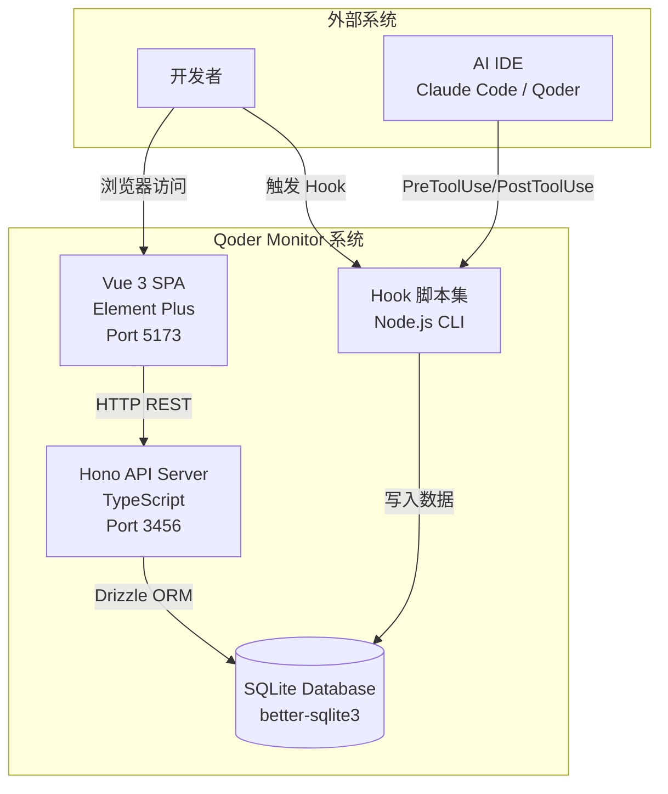
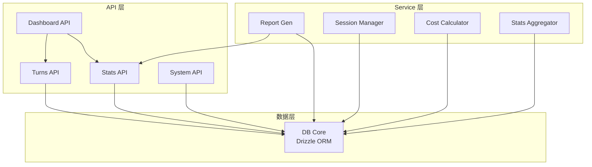
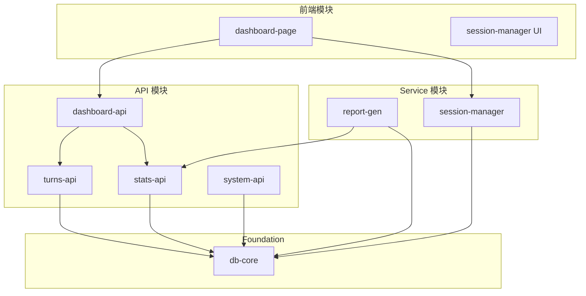
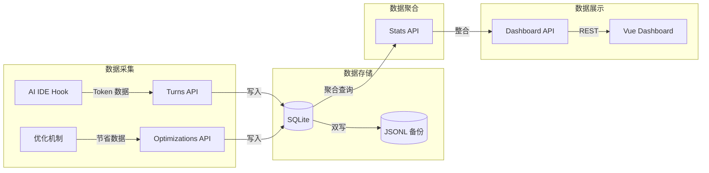

# Qoder Monitor — 架构设计文档

## 1. 项目概述与目标

### 1.1 项目背景

Qoder Monitor 是面向 AI IDE（Claude Code / Qoder）的 AI 执行追踪与性能监控平台。当前 AI 辅助开发过程中，Token 消耗、成本支出、A2A 通信开销完全不可见，导致无法评估优化策略效果，也无法控制预算风险。

### 1.2 项目目标

- **核心价值**：提供实时的 AI 调用追踪、Token 消耗统计、成本估算和优化节省量化
- **量化指标**：
  - 监控覆盖率：100% 的人机对话轮次和 A2A 消息被记录
  - 成本估算准确度：与实际账单误差不超过 15%
  - 优化节省可量化：6 大优化机制各节省 Token 数可独立统计
  - 数据延迟：从 AI 调用完成到看板展示不超过 5 秒

### 1.3 目标用户

| 角色 | 核心诉求 |
|------|---------|
| 个人开发者 | 了解自己的 Token 消耗和成本，优化使用习惯 |
| 技术团队负责人 | 掌握团队整体 AI 使用成本和效率，制定使用规范 |
| 平台运维人员 | 监控系统健康状态，排查数据采集异常 |

---

## 2. 系统架构图

### 2.1 系统级容器图



### 2.2 分层架构

```
┌─────────────────────────────────────────────────────┐
│                    API 层 (Hono Routes)              │
│  turns-api │ stats-api │ dashboard-api │ system-api │
├─────────────────────────────────────────────────────┤
│                  Service 层 (业务逻辑)                │
│  report-gen │ session-manager │ cost-calc │ stats   │
├─────────────────────────────────────────────────────┤
│                  数据层 (Drizzle ORM)                │
│  db-core │ schema │ repositories                    │
├─────────────────────────────────────────────────────┤
│                 SQLite (better-sqlite3)              │
└─────────────────────────────────────────────────────┘
```

### 2.3 API Server 内部组件



---

## 3. 分层架构描述

### 3.1 API 层

- **职责**：接收 HTTP 请求，参数校验，路由分发，响应格式化
- **技术**：Hono 4.x Router + Zod 校验
- **模块**：turns-api, stats-api, dashboard-api, system-api
- **端口**：3456
- **错误处理**：统一错误响应格式 `{ ok: false, error: { code, message } }`

### 3.2 Service 层

- **职责**：核心业务逻辑，跨模块协调，数据聚合计算
- **模块**：
  - session-manager：会话生命周期管理、聚合更新
  - report-gen：Markdown/HTML 报告生成
  - cost-calc：成本估算引擎
  - stats-aggregator：统计数据聚合器
- **规则**：Service 层不得直接依赖 HTTP 上下文

### 3.3 数据层

- **职责**：数据库连接管理、Schema 定义、查询封装
- **技术**：Drizzle ORM 0.36+ with better-sqlite3
- **特性**：
  - WAL 模式支持并发读写
  - JSONL 双写作为故障降级
  - 自动迁移（push-based）

---

## 4. 模块划分

### 4.1 模块依赖关系图



### 4.2 模块详情

#### 模块 1: db-core（Foundation，无依赖）

- **路径**：`backend/src/db/`
- **职责**：
  - Drizzle ORM Schema 定义（6 张表）
  - 数据库连接初始化与生命周期管理
  - SQLite WAL 模式配置
  - JSONL 双写降级策略
  - 基础 CRUD 封装

#### 模块 2: turns-api（依赖 db-core）

- **路径**：`backend/src/api/turns/`
- **职责**：
  - F-001：用户输入轮次记录
  - F-002：AI 回复轮次记录
  - F-003：A2A 消息记录
  - 轮次查询与筛选
- **关键业务规则**：
  - 同一 session 30 秒内用户输入去重
  - 同一 session 3 秒内 AI 回复去重
  - 多源降级：env → stdin → file → default

#### 模块 3: stats-api（依赖 db-core）

- **路径**：`backend/src/api/stats/`
- **职责**：
  - F-007：Token 消耗统计
  - F-008：成本估算
  - F-009：优化节省汇总
  - 模型分布统计

#### 模块 4: dashboard-api（依赖 turns-api + stats-api）

- **路径**：`backend/src/api/dashboard/`
- **职责**：
  - F-005：实时看板汇总数据
  - 多维度汇总卡片数据
  - 最近 50 条轮次明细

#### 模块 5: report-gen（依赖 db-core + stats-api）

- **路径**：`backend/src/services/report/`
- **职责**：
  - F-010：Markdown 报告生成
  - F-011：HTML 独立看板生成
  - 支持按会话筛选

#### 模块 6: system-api（依赖 db-core）

- **路径**：`backend/src/api/system/`
- **职责**：
  - F-012：数据重置
  - F-013：健康检查
  - 守护进程状态查询

#### 模块 7: dashboard-page（前端看板页面）

- **路径**：`frontend/src/views/dashboard/`
- **技术**：Vue 3 + Element Plus
- **职责**：
  - 汇总卡片展示
  - 轮次明细表格（支持筛选）
  - 模型分布展示
  - 自动刷新（每 5 秒轮询）

#### 模块 8: session-manager UI（前端会话管理）

- **路径**：`frontend/src/views/sessions/`
- **职责**：
  - F-006：会话筛选与切换
  - 会话列表展示
  - 会话选择切换视图

---

## 5. 数据流设计

### 5.1 核心数据流



### 5.2 实时刷新机制

- Dashboard 每 5 秒轮询 `GET /api/dashboard/summary`
- 不依赖 WebSocket，使用定时轮询
- 每次请求全量刷新，保证数据一致性

---

## 6. 技术选型理由

### 6.1 后端框架：Hono 4.x

| 维度 | Hono 4.x | Express |
|------|----------|---------|
| 性能 | 极轻量（< 10KB），Web Standard API | 较重，包含大量遗留中间件 |
| TypeScript 支持 | 原生一等支持 | 需要额外 @types |
| 启动速度 | 毫秒级 | 百毫秒级 |
| 生态 | 够用（CORS, JWT, Logger） | 极其丰富 |

**结论**：选择 Hono。项目为轻量内部工具，Hono 的极简设计、TypeScript 原生支持、快速启动特性更匹配需求。

### 6.2 ORM：Drizzle ORM 0.36+

| 维度 | Drizzle ORM | Prisma |
|------|------------|--------|
| 体积 | 极轻量（< 5KB） | 较重（含引擎层） |
| 性能 | 直接 SQL 映射，几乎零开销 | 有引擎层额外开销 |
| SQLite 支持 | 原生完善 | 实验性支持 |
| 类型安全 | TS 类型推断 | 代码生成 |

**结论**：选择 Drizzle。项目使用 SQLite，Drizzle 的 SQLite 支持更好、体积更轻、无引擎层依赖。

### 6.3 数据库：SQLite (better-sqlite3)

- 单用户/单团队本地工具，无需独立数据库服务
- WAL 模式支持并发读写
- JSONL 双写作为降级方案
- 降级备选：sql.js（纯 WASM）

### 6.4 前端：Vue 3 + Element Plus + Vite

- Vue 3.4：Composition API + 更好的响应式系统
- Element Plus 2.x：成熟的管理类组件库
- Vite 5.x：极速 HMR

### 6.5 测试：Vitest 2.x

- 原生 Vite 集成，零配置
- 兼容 Jest API
- ESM 原生支持

---

## 7. 项目目录结构

```
qoder-monitor/
├── backend/
│   ├── src/
│   │   ├── index.ts                 # Hono 应用入口
│   │   ├── db/
│   │   │   ├── index.ts             # 数据库连接初始化
│   │   │   ├── schema.ts            # Drizzle ORM Schema (6 表)
│   │   │   └── seed.ts              # 种子数据
│   │   ├── api/
│   │   │   ├── turns/
│   │   │   │   ├── index.ts         # 路由注册
│   │   │   │   └── handlers.ts      # 请求处理器
│   │   │   ├── stats/
│   │   │   │   ├── index.ts
│   │   │   │   └── handlers.ts
│   │   │   ├── dashboard/
│   │   │   │   ├── index.ts
│   │   │   │   └── handlers.ts
│   │   │   ├── optimizations/
│   │   │   │   ├── index.ts
│   │   │   │   └── handlers.ts
│   │   │   ├── pricing/
│   │   │   │   ├── index.ts
│   │   │   │   └── handlers.ts
│   │   │   ├── timers/
│   │   │   │   ├── index.ts
│   │   │   │   └── handlers.ts
│   │   │   └── system/
│   │   │       ├── index.ts
│   │   │       └── handlers.ts
│   │   ├── services/
│   │   │   ├── session-manager.ts
│   │   │   ├── cost-calculator.ts
│   │   │   ├── stats-aggregator.ts
│   │   │   └── report/
│   │   │       ├── markdown.ts
│   │   │       └── html.ts
│   │   ├── middleware/
│   │   │   ├── error-handler.ts
│   │   │   └── logger.ts
│   │   └── shared/
│   │       ├── errors.ts
│   │       └── types.ts
│   ├── package.json
│   ├── tsconfig.json
│   └── vitest.config.ts
├── frontend/
│   ├── src/
│   │   ├── App.vue
│   │   ├── main.ts
│   │   ├── api/
│   │   │   ├── client.ts
│   │   │   ├── turns.ts
│   │   │   ├── sessions.ts
│   │   │   ├── dashboard.ts
│   │   │   ├── optimizations.ts
│   │   │   ├── pricing.ts
│   │   │   └── system.ts
│   │   ├── views/
│   │   │   ├── dashboard/
│   │   │   │   ├── Dashboard.vue
│   │   │   │   ├── SummaryCards.vue
│   │   │   │   ├── TurnTable.vue
│   │   │   │   ├── ModelDist.vue
│   │   │   │   └── Savings.vue
│   │   │   └── sessions/
│   │   │       └── SessionList.vue
│   │   ├── components/
│   │   │   ├── EmptyState.vue
│   │   │   └── ErrorBoundary.vue
│   │   ├── stores/
│   │   │   ├── dashboard.ts
│   │   │   └── session.ts
│   │   └── utils/
│   │       ├── format.ts
│   │       └── constants.ts
│   ├── index.html
│   ├── package.json
│   ├── vite.config.ts
│   └── tsconfig.json
├── mocks/
│   └── ...
├── integration-tests/
│   ├── modules/
│   └── scenarios/
└── package.json
```

---

## 8. 错误码规范

### 8.1 统一响应格式

```typescript
// 成功响应
{ ok: true, data: T }

// 错误响应
{
  ok: false,
  error: {
    code: string,      // 错误码
    message: string,   // 用户可读描述
    details?: any      // 详细错误信息（开发模式）
  }
}
```

### 8.2 错误码定义

| 错误码 | HTTP 状态码 | 含义 | 典型场景 |
|--------|------------|------|---------|
| BAD_REQUEST | 400 | 请求参数校验失败 | 缺少必填字段、枚举值非法 |
| NOT_FOUND | 404 | 资源不存在 | session_id/turn_id 不存在 |
| VALIDATION_ERROR | 400 | 数据校验失败 | Token 值为负、消息大小超限 |
| CONFLICT | 409 | 数据冲突 | 重复写入 |
| INTERNAL_ERROR | 500 | 服务器内部错误 | JSON 解析异常 |
| DB_ERROR | 500 | 数据库操作异常 | 写入失败、SQLite 锁定 |
| RATE_LIMITED | 429 | 请求频率过高 | 重复采集过于频繁 |

### 8.3 错误处理中间件

```typescript
app.onError((err, c) => {
  if (err instanceof AppError) {
    return c.json({
      ok: false,
      error: { code: err.code, message: err.message }
    }, err.httpStatus);
  }
  return c.json({
    ok: false,
    error: { code: 'INTERNAL_ERROR', message: '服务器内部错误' }
  }, 500);
});
```

---

**【锁定版】** 已通过 Grill 审查
