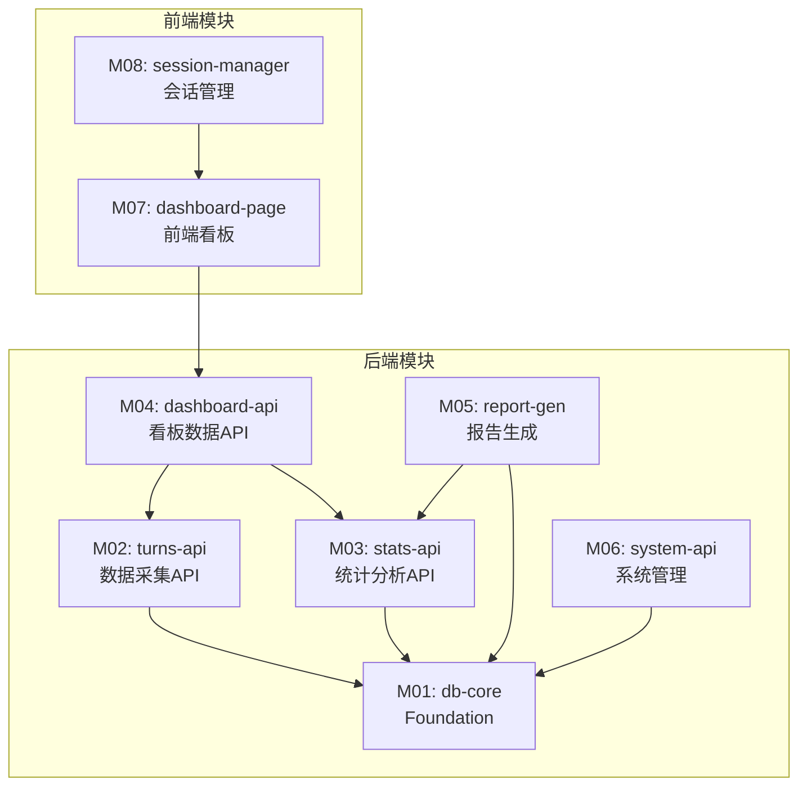

# Qoder Monitor — 任务全景图

> 基于 PRD.md【锁定版】+ spec.md【锁定版】+ schema.sql【锁定版】+ api-contract.yaml【锁定版】

## 项目概述

| 维度 | 内容 |
|------|------|
| 项目名称 | Qoder Monitor |
| 类型 | 全栈 Web 平台（内部工具） |
| 技术栈 | Hono 4.x + Vue 3 + Element Plus + Drizzle ORM + SQLite + Vite + Vitest |
| 模块数 | 8（后端 6 + 前端 2） |
| 总估算 | 23 人时 |

---

## 模块依赖关系图

---

## 模块清单

| 模块ID | 名称 | 模块类型 | 领域 | 直接依赖 | 估算工时 | 优先级 |
|--------|------|---------|------|---------|---------|--------|
| M01 | db-core | 后端 (Foundation) | 工具与配置 | 无 | 2h | P0 |
| M02 | turns-api | 后端 (API) | 业务核心 | M01 | 4h | P0 |
| M03 | stats-api | 后端 (API) | 业务核心 | M01 | 4h | P0 |
| M04 | dashboard-api | 后端 (API) | 业务核心 | M02, M03 | 2h | P0 |
| M05 | report-gen | 后端 (Service) | 工具与配置 | M01, M03 | 3h | P1 |
| M06 | system-api | 后端 (API) | 工具与配置 | M01 | 2h | P1 |
| M07 | dashboard-page | 前端 (Page) | 业务核心 | M04 | 4h | P0 |
| M08 | session-manager | 前端 (Component) | 业务核心 | M07 | 2h | P1 |

### 调度批次

| 批次 | 模块 | 并行数 | 说明 |
|------|------|--------|------|
| 第1批 | M01 db-core | 1 | Foundation，必须最先完成 |
| 第2批 | M02 turns-api + M03 stats-api + M06 system-api | 3 | 依赖 M01，可并行 |
| 第3批 | M04 dashboard-api + M05 report-gen | 2 | 依赖 M02/M03 |
| 第4批 | M07 dashboard-page | 1 | 依赖 M04 |
| 第5批 | M08 session-manager | 1 | 依赖 M07 |

---

## 后端模块详情

### M01: db-core（数据库核心）
- **路径**: `backend/src/db/`
- **核心文件**: `schema.ts`, `index.ts`, `seed.ts`
- **归口API**: 无（内部模块）
- **数据库表**: sessions, turns, optimizations, pricing, mechanisms, timers

### M02: turns-api（数据采集API）
- **路径**: `backend/src/api/turns/`
- **核心文件**: `index.ts`, `handlers.ts`, `validators.ts`
- **归口API**: POST/GET /api/turns, GET /api/turns/:id, GET /api/turns/stats, GET /api/turns/cost, GET /api/turns/savings, GET /api/turns/model-distribution
- **覆盖功能**: F-001, F-002, F-003, F-007, F-008, F-009

### M03: stats-api（统计分析API）
- **路径**: `backend/src/api/stats/`
- **核心文件**: `index.ts`, `handlers.ts`
- **归口API**: 同 M02 的 stats/cost/savings endpoints（与 M02 共享路由）
- **覆盖功能**: F-007, F-008, F-009（Service 层聚合逻辑）

### M04: dashboard-api（看板数据API）
- **路径**: `backend/src/api/dashboard/`
- **核心文件**: `index.ts`, `handlers.ts`
- **归口API**: GET /api/dashboard/summary
- **覆盖功能**: F-005

### M05: report-gen（报告生成）
- **路径**: `backend/src/services/report/`
- **核心文件**: `markdown.ts`, `html.ts`
- **归口API**: 无（内部 Service）
- **覆盖功能**: F-010, F-011

### M06: system-api（系统管理）
- **路径**: `backend/src/api/system/`
- **核心文件**: `index.ts`, `handlers.ts`
- **归口API**: DELETE /api/data, GET /api/health
- **覆盖功能**: F-012, F-013

---

## 前端模块详情

### M07: dashboard-page（前端看板页面）
- **路径**: `frontend/src/views/dashboard/`
- **组件**: `Dashboard.vue`, `SummaryCards.vue`, `TurnTable.vue`, `ModelDist.vue`, `Savings.vue`
- **依赖API**: GET /api/dashboard/summary
- **覆盖功能**: F-005

### M08: session-manager（前端会话管理）
- **路径**: `frontend/src/views/sessions/`
- **组件**: `SessionList.vue`
- **依赖API**: GET /api/sessions, GET /api/sessions/:id
- **覆盖功能**: F-006

---

## 模块间通信方式

| 场景 | 通信方式 | 说明 |
|------|---------|------|
| 后端模块间 | 函数直接调用 | 同进程内调用 Service 层函数 |
| 后端→前端 | REST API (JSON) | 前端通过 axios 调用后端 API |
| 前端模块间 | Vue Router + Pinia Store | 页面路由切换和状态共享 |

---

**【锁定版】** 已通过 Grill 审查
