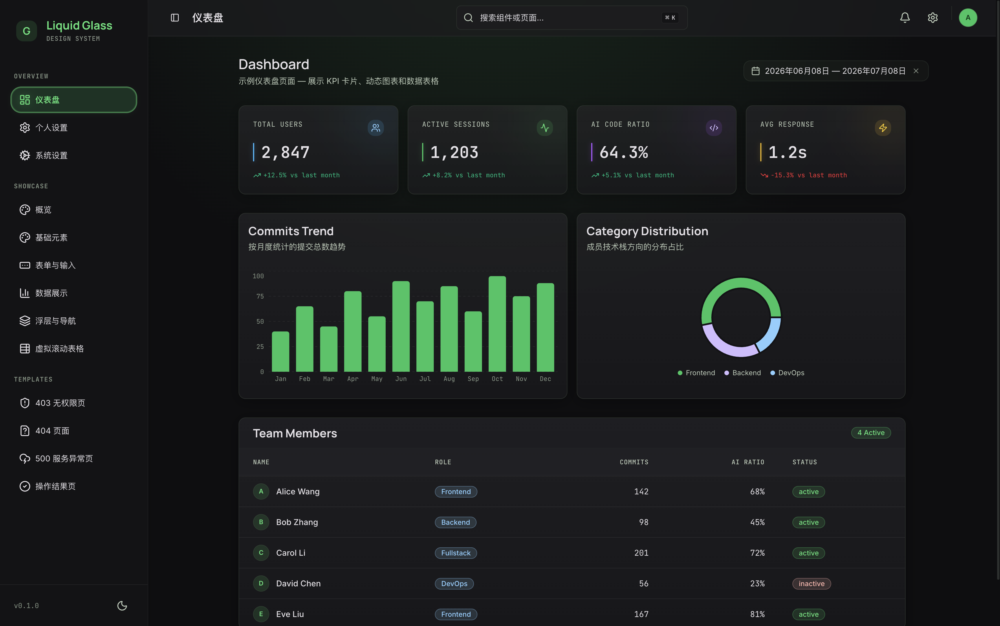

# Liquid Glass Starter Design System

[](http://192.168.110.214:11070)

一个轻量、精美的 Web UI 启动模板，支持 Dark/Light 双主题，通过 CSS 变量驱动，**改主色只需修改变量，无需动组件代码**。



### 🎨 设计系统规范 (Design System Specs)

本项目基于独特的 **Liquid Glass (毛玻璃拟态)** 视觉语言构建。详细的设计、色彩与排版规范请参阅唯一的 [设计系统规范 (DESIGN.md)](./DESIGN.md) 手册。

---

## Quick Start (AI-Native 脚手架创建)

本项目支持通过 **AI 技能 (Agent Skill)** 交互式地在本地生成新项目。无论是全栈 TS Monorepo 还是异构后端（Go/Kotlin 平铺目录），都支持一键重构与自动依赖安装。

### 1. 安装/更新 AI 技能

您可以通过 `npx giget` 命令，免去克隆整个仓库的开销，直接将脚手架技能下载并安装到对应 AI Agent 的全局配置目录中：

#### macOS / Linux / Git Bash / WSL (使用 `~`)

- **Qoder：**
  ```bash
  npx giget git:git@192.168.110.2:starters/liquid-glass-starter/skills/wecode-project-scaffolder ~/.qoder/skills/wecode-project-scaffolder --force
  ```
- **Claude Code：**
  ```bash
  npx giget git:git@192.168.110.2:starters/liquid-glass-starter/skills/wecode-project-scaffolder ~/.claude/skills/wecode-project-scaffolder --force
  ```
- **Gemini / Antigravity：**
  ```bash
  npx giget git:git@192.168.110.2:starters/liquid-glass-starter/skills/wecode-project-scaffolder ~/.gemini/config/skills/wecode-project-scaffolder --force
  ```

#### Windows (PowerShell)

- **Qoder：**
  ```powershell
  npx giget git:git@192.168.110.2:starters/liquid-glass-starter/skills/wecode-project-scaffolder "$HOME\.qoder\skills\wecode-project-scaffolder" --force
  ```
- **Claude Code：**
  ```powershell
  npx giget git:git@192.168.110.2:starters/liquid-glass-starter/skills/wecode-project-scaffolder "$HOME\.claude\skills\wecode-project-scaffolder" --force
  ```
- **Gemini / Antigravity：**
  ```powershell
  npx giget git:git@192.168.110.2:starters/liquid-glass-starter/skills/wecode-project-scaffolder "$HOME\.gemini\config\skills\wecode-project-scaffolder" --force
  ```

#### Windows (CMD - 命令提示符)

- **Qoder：**
  ```cmd
  npx giget git:git@192.168.110.2:starters/liquid-glass-starter/skills/wecode-project-scaffolder "%USERPROFILE%\.qoder\skills\wecode-project-scaffolder" --force
  ```
- **Claude Code：**
  ```cmd
  npx giget git:git@192.168.110.2:starters/liquid-glass-starter/skills/wecode-project-scaffolder "%USERPROFILE%\.claude\skills\wecode-project-scaffolder" --force
  ```
- **Gemini / Antigravity：**
  ```cmd
  npx giget git:git@192.168.110.2:starters/liquid-glass-starter/skills/wecode-project-scaffolder "%USERPROFILE%\.gemini\config\skills\wecode-project-scaffolder" --force
  ```

> 💡 **提示**：若技能后续有更新，只需重新运行上述对应助手的命令即可完成覆盖升级。

### 2. 通过 AI 一键创建

在新目录中开启与 AI 助手的对话，发送以下任意指令激活技能：

- `用 Liquid Glass Starter 新建项目`
- `搭建脚手架`
- `scaffold project`

AI 助手将引导您完成交互式参数收集并自动在指定目录下完成项目生成。

---

## 备用方案：通过本地 CLI 脚本创建

如果不通过 AI 交互，您也可以在确保本地安装了 Bun 之后，直接通过命令行调用脚本：

```bash
bun run skills/wecode-project-scaffolder/scripts/scaffold.ts \
  --name "my-project-name" \
  --target "/absolute/path/to/my-project" \
  --type "monorepo" \ # 可选: monorepo | flat-go | flat-java (Kotlin)
  --clean-demo true   # 可选: true | false
```

---

## 项目结构 (Monorepo)

本项目采用 `Bun Workspaces` 管理的多工作区全栈结构：

```
├── apps/
│   ├── web/              # 前端子项目 (Vite + React SPA)
│   │   ├── src/          # 前端源代码
│   │   ├── public/       # 前端静态资源
│   │   ├── index.html    # 前端入口 HTML
│   │   ├── vite.config.ts
│   │   └── package.json
│   └── api/              # 后端子项目 (Hono API 服务)
│       ├── src/          # 后端源代码
│       │   └── index.ts  # Hono 服务入口
│       ├── tsconfig.json
│       └── package.json
├── packages/
│   └── shared/           # 共享工具/校验包 (Zod Schema, TS 类型等)
│       ├── src/          # 共享代码
│       ├── tsconfig.json
│       └── package.json
├── package.json          # Monorepo 根配置 (定义 workspaces)
├── .prettierrc
├── .prettierignore
├── .gitignore
├── eslint.config.js
└── README.md
```

## 开箱即用

```bash
bun install
bun run dev
```

| 路由                      | 展示内容                                                       |
| ------------------------- | -------------------------------------------------------------- |
| `/login`                  | 毛玻璃背景 + blob 动画 + 表单 + 错误态 + loading               |
| `/dashboard`              | 仪表盘 Demo (KPI 卡片 + 柱状图 + 环形图 + 数据表格)            |
| `/components`             | 组件总览 (Utility Classes 展示)                                |
| `/components/foundations` | 基础规范 (字体、间距、圆角、背景样式)                          |
| `/components/forms`       | 表单相关组件与表单域                                           |
| `/components/data`        | 数据交互组件 (表格、分页、筛选、骨架屏)                        |
| `/components/overlays`    | 浮层与导航组件 (Tabs, Dialog, Sheet, Alerts, Toast & TreeView) |
| `/virtual-table`          | 虚拟滚动大数据表格 Demo (10,000 行)                            |
| `/settings`               | 个人设置页                                                     |
| `/system-settings`        | 系统设置页 (配置管理)                                          |
| `/403-demo`               | 403 无权限页 Demo                                              |
| `/404-demo`               | 404 页面 Demo                                                  |
| `/500-demo`               | 500 服务异常页 Demo                                            |
| `/result-demo`            | 操作结果页 Demo                                                |
| `/*`                      | 404 Not Found 页面                                             |

---

## 快速接入（3 步）

### 1. 初始化项目环境

```bash
# 创建 Vite + React + TypeScript 项目
npm create vite@latest my-app -- --template react-ts
cd my-app

# 安装 Tailwind CSS v4 及其相关支持
npm install tailwindcss @tailwindcss/vite tw-animate-css

# 初始化 shadcn/ui（选择 neutral base color）
npx shadcn@latest init
```

### 2. 复制主题文件

将以下文件复制到新项目 `src/` 目录下：

```bash
cp apps/web/src/index.css apps/web/src/theme-tokens.css apps/web/src/design-utils.css your-project/src/
cp -r apps/web/src/components/* your-project/src/components/
cp -r apps/web/src/lib/* your-project/src/lib/
cp -r apps/web/src/assets/fonts your-project/src/assets/
```

在 `src/index.css` 中调整字体路径：

```css
/* 将 ./fonts/fonts.css 改为实际路径 */
@import "./assets/fonts/fonts.css";
```

### 3. 安装依赖

```bash
# 安装基础依赖与所有业务组件所需依赖
npm install clsx tailwind-merge lucide-react class-variance-authority radix-ui react-router-dom
npm install date-fns react-day-picker recharts cmdk zod
```

在 `App.tsx` 中包裹 ThemeProvider：

```tsx
import { ThemeProvider } from "./components/theme-provider"

function App() {
  return <ThemeProvider defaultTheme="system">{/* 你的应用 */}</ThemeProvider>
}
```

---

## 可用脚本 (Root Commands)

在项目根目录下可以运行以下命令管理所有子项目：

| 命令                   | 说明                                                      |
| ---------------------- | --------------------------------------------------------- |
| `bun run dev`          | 同时启动前端开发服务器 (5173端口) 和 Hono 后端 (3000端口) |
| `bun run dev:web`      | 单独启动前端开发服务器                                    |
| `bun run dev:api`      | 单独启动后端开发服务器                                    |
| `bun run build`        | 编译打包所有子模块（shared ➡️ api ➡️ web）                |
| `bun run build:shared` | 单独编译 shared 共享模块                                  |
| `bun run build:web`    | 单独编译前端静态包                                        |
| `bun run build:api`    | 单独编译后端 API 代码                                     |
| `bun run typecheck`    | 执行全局 TypeScript 类型检查                              |
| `bun run lint`         | 运行 ESLint 检查                                          |
| `bun run test`         | 运行全部单元测试 (shared + web + api)                     |
| `bun run test:web`     | 运行前端 Vitest 单元测试                                  |
| `bun run test:api`     | 运行后端 Bun 单元测试                                     |
| `bun run test:shared`  | 运行共享包单元测试                                        |
| `bun run test:ci`      | CI 模式测试 (含覆盖率)                                    |
| `bun run arch:check`   | 架构依赖检查                                              |

**数据库命令**（在 `apps/api` 目录下运行）：

| 命令                  | 说明                       |
| --------------------- | -------------------------- |
| `bun run db:generate` | 修改 Schema 后生成迁移 SQL |
| `bun run db:migrate`  | 应用迁移到 SQLite 数据库   |

---

## 核心组件使用示例

### 1. KPI 卡片 (`KpiCard`)

新封装的通用 KPI 卡片组件，集成毛玻璃、背景彩色发光光晕 (Blob)、左侧特色指示条与 Hover 呼吸发光特效：

```tsx
import { KpiCard } from "@/components/ui/kpi-card"
import { DollarSign } from "lucide-react"
;<KpiCard
  title="Monthly Revenue"
  value="$42.5K"
  icon={DollarSign}
  accentColor="green" // 支持 "green" | "blue" | "red" | "purple" | "yellow" | "default"
  trend={{ value: "+12.5%", direction: "up", label: "vs last month" }}
  loading={false}
/>
```

### 2. 日期范围选择器 (`DateRangePicker`)

集成 Popover 与日历的多月份选择组件：

```tsx
import { DateRangePicker } from "@/components/ui/date-range-picker"
import { useState } from "react"
import { type DateRange } from "react-day-picker"

const [dateRange, setDateRange] = useState<DateRange | undefined>()

<DateRangePicker
  dateRange={dateRange}
  onDateRangeChange={setDateRange}
/>
```

---

## 切换主题色

打开 `theme-tokens.css`，搜索 `★★★` 标记，找到需要修改的变量组。

### 示例：蓝色主题

替换 `:root` 中的主色变量：

```css
:root {
  /* shadcn 层 */
  --primary: #3b82f6; /* 蓝500 */
  --accent: rgba(59, 130, 246, 0.1);
  --accent-foreground: #60a5fa; /* 蓝400 */
  --ring: rgba(96, 165, 250, 0.5);
  --chart-1: #60a5fa;
  --chart-2: #3b82f6;

  /* Liquid Glass 层 */
  --lg-primary: #3b82f6;
  --lg-primary-light: #60a5fa;
  --lg-primary-dim: rgba(59, 130, 246, 0.15);
  --lg-primary-container: #3b82f6;
  --lg-on-primary: #1e3a5f;
  --lg-on-primary-container: #1e40af;

  /* 阴影辉光 */
  --shadow-glow-primary: 0 0 8px rgba(59, 130, 246, 0.4);
  --shadow-glow-soft: 0 0 20px rgba(59, 130, 246, 0.1);

  /* Sidebar */
  --sidebar-primary: #60a5fa;
  --sidebar-primary-foreground: #1e3a5f;
  --sidebar-accent: rgba(59, 130, 246, 0.1);
  --sidebar-accent-foreground: #60a5fa;
  --sidebar-ring: rgba(96, 165, 250, 0.5);
  --sidebar-active-hover-bg: rgba(59, 130, 246, 0.22);
  --sidebar-active-hover-border: rgba(59, 130, 246, 0.24);
}
```

Light 主题同步修改 `.light { ... }` 块中对应变量即可。

### 常用主题色参考

| 色系         | `--primary` | `--lg-primary-light` |
| ------------ | ----------- | -------------------- |
| 绿色（默认） | `#22c55e`   | `#4be277`            |
| 蓝色         | `#3b82f6`   | `#60a5fa`            |
| 紫色         | `#8b5cf6`   | `#a78bfa`            |
| 橙色         | `#f97316`   | `#fb923c`            |
| 青色         | `#06b6d4`   | `#22d3ee`            |
| 玫红         | `#ec4899`   | `#f472b6`            |

---

## 可用 Utility Classes

| Class                                                   | 用途                                                                     |
| ------------------------------------------------------- | ------------------------------------------------------------------------ |
| `.glass-card`                                           | 毛玻璃卡片（带阴影，通常需要配合 `p-0 py-0 gap-0` 来放置表格等紧密布局） |
| `.liquid-card`                                          | 毛玻璃卡片（无阴影）                                                     |
| `.liquid-glass`                                         | 毛玻璃容器                                                               |
| `.glass-row`                                            | 表格行（hover 左侧主色条）                                               |
| `.kpi-accent`                                           | KPI 左侧发光竖条                                                         |
| `.liquid-accent`                                        | 普通左侧竖条                                                             |
| `.btn-primary`                                          | 主色按钮（高可读文字对比度）                                             |
| `.btn-secondary`                                        | 次要按钮                                                                 |
| `.glass-input`                                          | 毛玻璃输入框                                                             |
| `.badge-active`                                         | 激活状态徽章                                                             |
| `.badge-inactive`                                       | 未激活徽章                                                               |
| `.tag-green` / `.tag-blue` / `.tag-purple` / `.tag-red` | 彩色标签                                                                 |
| `.skeleton-glass`                                       | 骨架屏加载                                                               |
| `.section-title`                                        | 章节标题                                                                 |
| `.data-label`                                           | 等宽大写标签                                                             |
| `.font-h1` / `.font-h2`                                 | 标题字体                                                                 |
| `.font-data-display`                                    | 数据展示大字体                                                           |
| `.chart-container`                                      | 图表容器                                                                 |

---

## 快捷键

- **D 键**：切换 Dark/Light（theme-provider 内置）
- **⌘K / Ctrl+K**：需自行实现 Command Palette （展示 Demo 页面中已内置 Radix CommandDialog 触发）

---

## 依赖清单

| 包                                        | 用途                                |
| ----------------------------------------- | ----------------------------------- |
| `tailwindcss` (v4.2+)                     | 核心样式引擎                        |
| `@tailwindcss/vite`                       | Vite 插件                           |
| `tw-animate-css`                          | 精细动画插件                        |
| `shadcn`                                  | UI 辅助管理工具                     |
| `clsx` & `tailwind-merge`                 | 动态样式类安全合并                  |
| `lucide-react`                            | 图标库                              |
| `class-variance-authority` (cva)          | 组件状态多属性映射管理              |
| `radix-ui` / `react-router-dom`           | UI 底层原语与路由支持               |
| `date-fns` & `react-day-picker`           | 日历与日期范围选择支持              |
| `recharts`                                | Recharts 数据可视化渲染             |
| `cmdk`                                    | Radix 基础的 Command Palette 输入框 |
| `zod`                                     | 数据模式验证                        |
| `react-hook-form` + `@hookform/resolvers` | 表单状态管理与校验                  |
| `zustand`                                 | 轻量状态管理                        |
| `axios`                                   | HTTP 客户端                         |
| `@tanstack/react-virtual`                 | 大数据表格虚拟滚动                  |
| `sonner`                                  | Toast 通知组件                      |
| `vitest` + `happy-dom`                    | 单元测试框架                        |
| `husky` + `lint-staged`                   | Git Hooks 代码质量门禁              |
| `eslint-plugin-simple-import-sort`        | Import 自动排序                     |
| `eslint-plugin-jsx-a11y`                  | 无障碍检测                          |

---

## 工程化能力

| 能力            | 工具                                               |
| --------------- | -------------------------------------------------- |
| 代码分割        | React.lazy + Suspense + Vite manualChunks          |
| Pre-commit 检查 | Husky v9 + lint-staged (typecheck + lint + format) |
| Import 排序     | eslint-plugin-simple-import-sort (自动修复)        |
| 无障碍检测      | eslint-plugin-jsx-a11y (warn 级别)                 |
| 单元测试        | Vitest + happy-dom                                 |
| API 安全        | hono/secure-headers + CORS 白名单                  |
| 页面过渡        | View Transitions API (React Router DOM v7 原生)    |

---

## 设计特点

- **Glassmorphism**：backdrop-filter + 半透明背景
- **双主题**：Dark 为默认，Light 同样完整
- **CSS 变量驱动**：所有颜色通过变量引用，改一处全局生效
- **三字体系统**：Manrope（标题）/ Inter（正文）/ JetBrains Mono（代码/数据）
- **辉光效果**：primary 色自带 glow shadow，增强视觉层次

---

## 切换其他语言后端 (Switching to Go/Kotlin)

如果您想在本项目中将 Node.js (Hono) 后端换成 **Go** 或 **Kotlin (Spring Boot)** 等其他语言，为了避免 JavaScript/Bun 工作区工具链对非 Node 后端开发造成干扰，**强烈建议摒弃原有的 JS Monorepo 物理结构，改用更自然的「平铺双目录」结构**。

以下是推荐的迁移与协作步骤：

### 1. 调整目录结构

将项目重构为前后端完全独立的平铺文件夹，让各自 of IDE 能够完美识别：

```
my-project/
├── frontend/             # 前端项目 (将 apps/web 移动至此并重命名)
│   ├── src/
│   ├── package.json
│   └── vite.config.ts
├── backend/              # 后端项目 (新建并存放您的 Go/Kotlin 源码)
│   ├── go.mod / build.gradle.kts  # 后端依赖配置直接置于根目录
│   └── src/ (或 main.go)
├── Taskfile.yml          # [可选] 通用任务配置文件 (用于跨语言一键启动)
├── .gitignore
└── README.md
```

_重构后，请删除原根目录的 `package.json`、`bun.lock` 以及 `packages/shared` 目录，前端的 Node/Bun 依赖管理应全部收拢在 `/frontend` 目录内。_

### 2. (可选) 引入通用任务运行器 (Taskfile)

为了避免在根目录下残留冗余 of JS 依赖来调度后端命令，建议使用与语言无关的任务管理工具 **[Taskfile](https://taskfile.dev/)** 来管理跨语言任务。
在根目录新建 `Taskfile.yml`：

```yaml
version: "3"

tasks:
  dev:
    desc: 同时并发启动前端和后端开发服务器
    deps: [dev:frontend, dev:backend]

  dev:frontend:
    dir: frontend
    cmds:
      - bun run dev

  dev:backend:
    dir: backend
    cmds:
      - go run main.go # 如果是 Kotlin (Spring Boot) 改为: gradle bootRun
```

_系统安装 `task` CLI（如 macOS 执行 `brew install go-task`）后，在根目录直接运行 `task dev` 即可一键启动前后端。_

### 3. 微调前端代理端口

修改前端 [frontend/vite.config.ts](file:///frontend/vite.config.ts) 中的代理目标，使其指向 Go/Kotlin 后端的实际运行端口（例如 Spring Boot 默认的 `8080`）：

```typescript
server: {
  proxy: {
    "/api": {
      target: "http://localhost:8080", // ⬅️ 指向您的 Go 或 Kotlin 服务实际运行端口
      changeOrigin: true,
      rewrite: (path) => path.replace(/^\/api/, ""),
    },
  },
}
```

### 4. 使用 OpenAPI + 代码生成保持“类型安全”

在异构后端中，我们无法再直接共享 TypeScript 类型。推荐使用**契约驱动开发**：

1. **后端导出契约**：让 Go（利用 `swag` / `swaggo`）或 Kotlin（利用 `springdoc-openapi`）在编译/运行时自动生成标准的 OpenAPI (Swagger) `openapi.json` 规范文件。
2. **前端自动生成 SDK**：在前端目录下，通过配置 [Orval](https://orval.dev/) 或使用 `openapi-typescript` 命令行，拉取后端的 Swagger 配置并一键生成完整的 TS 客户端：
   ```bash
   npx openapi-typescript http://localhost:8080/v3/api-docs -o src/types/api.d.ts
   ```
   _这能确保前端开发时，仍然能获得 100% 准确的 API 请求/响应类型提示与编译期纠错。_

### 5. 遵守 Service 封装层规范 (防腐层)

请务必遵循 [AGENTS.md](file:///AGENTS.md) 中的**服务层（Service Layer）封装规范**：

- 所有网络请求（包括自动生成的 SDK 客户端）必须统一封装在 `frontend/src/services/` 目录下（例如 `services/auth.ts`）。
- UI 组件仅能引入并调用 Service 暴露的普通异步函数，**绝对禁止**将异构后端 SDK 语法直接泄露到 React Page 组件中。这样能确保未来无论底层接口如何变更，UI 视图层均无需发生任何重构。

---

## 数据库与 ORM 选型推荐 (Database & ORM Recommendations)

本项目 **已内置** Drizzle ORM + `bun:sqlite` 作为默认数据库层，开箱即用：

- **Schema 定义**：`apps/api/src/db/schema.ts`
- **连接配置**：`apps/api/src/db/index.ts`（使用 Bun 原生 `bun:sqlite`）
- **Drizzle 配置**：`apps/api/drizzle.config.ts`
- **迁移文件**：`apps/api/drizzle/`
- **本地数据库**：`apps/api/sqlite.db`（已被 `.gitignore` 排除）
- **种子用户**：`admin`（启动时自动写入）

### 常用开发流程

1. 修改 `apps/api/src/db/schema.ts` 中的表结构
2. 在 `apps/api` 目录下运行 `bun run db:generate` 生成迁移 SQL
3. 重启 API 服务，迁移会在启动时自动应用

### 脚手架选项

使用 `wecode-project-scaffolder` 创建新项目时：

- `--db drizzle`（默认）：保留内置数据库层
- `--db none`：剥离所有数据库代码，恢复为纯 Mock API

### 其他架构的数据库选型

使用脚手架创建平铺异构项目时，可选择以下数据库方案：

**Go 后端 → GORM + SQLite / PostgreSQL**

- Go 社区事实标准，支持 Auto-Migrate 自动建表
- 本地数据库文件：`backend/gorm.db`

**Kotlin 后端 → Spring Data JPA + H2 / MySQL**

- Spring Boot 官方 starter + Hibernate JPA，开发阶段使用内存型 H2
- 启动：`gradle bootRun`，JPA 自动初始化表结构

---

## 部署方案 (Deployment Strategies)

本项目支持两种主流的部署模式，您可以根据开发速度与成本考量自由切换。

### 方案一：前后端一把梭 (Fullstack Monolith Deployment) — 💡 低成本、单实例推荐

在该模式下，您的 Hono 后端服务器将同时提供 API 路由并托管前端编译出的静态资源包。您在生产环境只需要运行一个 Node.js 进程。

#### 1. 前后端配置整合

在 `apps/api/src/index.ts` 中引入 Hono 的静态托管中间件：

```typescript
import { serveStatic } from "@hono/node-server/serve-static"

// 托管前端编译生成的静态资源 (在生产环境将 web/dist 作为静态资源服务根目录)
app.use("/*", serveStatic({ root: "../web/dist" }))
```

#### 2. 构建与运行步骤

```bash
# 1. 在根目录下编译打包所有项目 (生成 shared/dist, api/dist, web/dist)
bun run build

# 2. 运行后端服务
cd apps/api
bun run start
```

_此时，访问后端服务地址（如 `http://your-server-ip:3000`），即可直接访问运行完整的 React 前端网页，且所有 `/api` 接口完美同源工作。_

---

### 方案二：前后端分离 (Separated Deployment) — 💡 高弹性、高并发推荐

在该模式下，前端和后端是完全解耦独立部署的。前端部署在静态托管平台上，后端部署在独立的应用服务器上。

#### 1. 前端部署 (Vite SPA)

- **构建前端静态文件**：在根目录下运行 `bun run build:web`（或 `bun run build`）。
- **分发静态文件**：直接将 `apps/web/dist` 目录内的所有文件部署到 CDN、腾讯云 COS、阿里云 OSS、Nginx，或免费静态托管平台（如 Cloudflare Pages, Netlify, Vercel）。
- _由于是纯静态资源，此部署几乎是**零成本**且具备极高的抗并发能力。_

#### 2. 后端部署 (Hono API)

- **构建后端服务**：在根目录下运行 `bun run build:api`。
- **运行后端进程**：可以使用 Docker、PM2 等进程管理器将 `apps/api/dist` 部署在您的云服务器上，并公开端口（如 `3000`）。
- **跨域处理**：已在 `apps/api/src/index.ts` 中集成了 `cors()` 中间件，前端可以通过跨域安全地发起 API 调用（此时需要修改前端请求的 BaseURL 域名，或者在前端的托管服务器上配置反向代理）。
